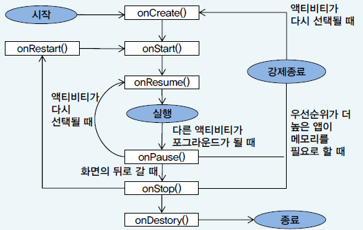

## 목차

- [안드로이드 프로젝트 구성 (1)](#안드로이드-프로젝트-구성-1)
  - [안드로이드 프로젝트 구조](#안드로이드-프로젝트-구조)
- [안드로이드 프로젝트 구성 (2)](#안드로이드-프로젝트-구성-2)
- [안드로이드 프로젝트 구성 (3)](#안드로이드-프로젝트-구성-3)
- [안드로이드 앱의 실행 과정](#안드로이드-앱의-실행-과정)
  - [컴파일 과정](#컴파일-과정)
  - [안드로이드 앱 배포과정](#안드로이드-앱-배포과정)
- [XML 레이아웃의 장점](#xml-레이아웃의-장점)
- [View](#view)
  - [1) 액티비티와 View](#1-액티비티와-view)
  - [2) View의 종류](#2-view의-종류)
    - [ViewGroup](#viewgroup)
    - [위젯](#위젯)
  - [3) View의 속성](#3-view의-속성)
    - [3-1) id 속성](#3-1-id-속성)
    - [3-2) clickable, longClickable 속성](#3-2-clickable-longclickable-속성)
    - [3-3) background 속성](#3-3-background-속성)
    - [3-4) padding 속성](#3-4-padding-속성)
    - [3-5) visibility 속성](#3-5-visibility-속성)
    - [3-6) focusable 속성](#3-6-focusable-속성)
- [TextView](#textview)
  - [1) TextView의 속성](#1-textview의-속성)
  - [2) text 속성](#2-text-속성)
  - [3) textColor 속성](#3-textcolor-속성)
  - [4) textSize 속성](#4-textsize-속성)
  - [5) textStyke 속성](#5-textstyke-속성)
  - [6) typeFace 속성](#6-typeface-속성)
  - [7) width, height 속성](#7-width-height-속성)
  - [8) singleLine 속성](#8-singleline-속성)
  - [9) gravity 속성](#9-gravity-속성)
- [ImageView](#imageview)
  - [1) Src 속성](#1-src-속성)
  - [2) 이미지 포맷](#2-이미지-포맷)
  - [3) res/drawable](#3-resdrawable)
  - [4) maxHeight, maxWidth 속성과 minHeight, minWidth 속성](#4-maxheight-maxwidth-속성과-minheight-minwidth-속성)
  - [5) adjustViewBounds 속성](#5-adjustviewbounds-속성)
  - [6) cropToPadding 속성](#6-croptopadding-속성)
  - [7) tint 속성](#7-tint-속성)
  - [8) scaleType 속성](#8-scaletype-속성)
- [Button](#button)
- [EditText](#edittext)
- [ViewGroup](#viewgroup-1)
  - [1) layout_width, layout_height 속성](#1-layout_width-layout_height-속성)
  - [3) Padding 속성](#3-padding-속성)
  - [4) layout_margin](#4-layout_margin)
  - [5) padding과 layout_margin](#5-padding과-layout_margin)
- [LinearLayout](#linearlayout)
  - [1) orientation 속성](#1-orientation-속성)
  - [2) basedlineAligned 속성](#2-basedlinealigned-속성)
  - [3) layout_gravity](#3-layout_gravity)
  - [4) layout_weight](#4-layout_weight)
- [RelativeLayout](#relativelayout)
  - [1) 리소스 컴파일러와의 관계](#1-리소스-컴파일러와의-관계)
  - [2) RelativeLayout의 배치상의 어려움](#2-relativelayout의-배치상의-어려움)
  - [3) RelativeLayout의 논리상의 문제점](#3-relativelayout의-논리상의-문제점)
- [AbsuoluteLayout](#absuolutelayout)
  - [1) 좌표 지정 방법 고려 사항](#1-좌표-지정-방법-고려-사항)
- [FrameLayout](#framelayout)
  - [FrameLayout 실용성](#framelayout-실용성)
  - [FrameLayout 속성](#framelayout-속성)
- [TableLayout](#tablelayout)
  - [TableLayout - 표의 속성](#tablelayout---표의-속성)
  - [TableLayout - 차일드 View의 경우](#tablelayout---차일드-view의-경우)
  - [TableLayout 속성 변경](#tablelayout-속성-변경)
- [레이아웃의 중첩](#레이아웃의-중첩)
- [실행 중에 속성 바꾸기](#실행-중에-속성-바꾸기)
  - [엘리먼트 속성 변경](#엘리먼트-속성-변경)
    - [1) 속성 변경 방법 - orientation](#1-속성-변경-방법---orientation)
    - [2) 속성 변경 방법 - gravity](#2-속성-변경-방법---gravity)
    - [3) 속성 변경 방법 - TextView](#3-속성-변경-방법---textview)
- [Canvas](#canvas)
  - [1) CustomView](#1-customview)
  - [2) Canvas](#2-canvas)
  - [3) Canvas의 메소드](#3-canvas의-메소드)
  - [4) Paint 객체](#4-paint-객체)
    - [4-1) setColor 메소드](#4-1-setcolor-메소드)
    - [4-2) setStrokeCap](#4-2-setstrokecap)
    - [4-3) setStrokeJoin](#4-3-setstrokejoin)
    - [4-4) setStyle](#4-4-setstyle)
- [Toast](#toast)
  - [Toast 객체](#toast-객체)
  - [makeText 메소드](#maketext-메소드)
- [소리 츨력](#소리-츨력)
- [안드로이드 이벤트 처리](#안드로이드-이벤트-처리)
- [콜백 메소드를 통한 이벤트 처리](#콜백-메소드를-통한-이벤트-처리)
  - [콜백 메소드 재정의](#콜백-메소드-재정의)
  - [대표적인 콜백 메소드](#대표적인-콜백-메소드)
  - [콜백 메소드](#콜백-메소드)
  - [콜백 메소드를 통한 이벤트 처리시 단점](#콜백-메소드를-통한-이벤트-처리시-단점)
- [리스너 인터페이스를 통한 이벤트 처리](#리스너-인터페이스를-통한-이벤트-처리)
  - [리스너 인터페이스](#리스너-인터페이스)
  - [대표적인 리스너와 메소드](#대표적인-리스너와-메소드)
  - [리스너 객체](#리스너-객체)
  - [등록 메소드](#등록-메소드)
  - [리스너 객체 등록 메소드](#리스너-객체-등록-메소드)
  - [터치 이벤트 발생시](#터치-이벤트-발생시)
  - [콜백 메소드 상속](#콜백-메소드-상속)
  - [단점 및 한계](#단점-및-한계)
- [액티비티를 통한 리스너의 구현](#액티비티를-통한-리스너의-구현)
  - [액티비티의 리스너 구현](#액티비티의-리스너-구현)
  - [액티비티 객체](#액티비티-객체)
  - [단점 및 한계](#단점-및-한계-1)
- [View를 통한 리스너의 구현](#view를-통한-리스너의-구현)
- [안드로이드 플랫폼의 구조](#안드로이드-플랫폼의-구조)
  - [애플리케이션](#애플리케이션)
  - [애플리케이션 프레임워크](#애플리케이션-프레임워크)
  - [라이브러리](#라이브러리)
  - [안드로이드 런타임](#안드로이드-런타임)
  - [안드로이드 커널](#안드로이드-커널)
- [입력 이벤트 처리](#입력-이벤트-처리)
  - [1. 핸들러의 우선순위](#1-핸들러의-우선순위)
    - [onTouch 핸들러 비교](#ontouch-핸들러-비교)
  - [2. 화면 터치 입력 처리](#2-화면-터치-입력-처리)
    - [화면 터치 이벤트](#화면-터치-이벤트)
    - [MotionEvent 객체](#motionevent-객체)
  - [3. 키보드 입력 처리](#3-키보드-입력-처리)
    - [키보드 이벤트](#키보드-이벤트)
    - [KeyEvent 객체](#keyevent-객체)
    - [keyCode](#keycode)
    - [getAction 메소드](#getaction-메소드)
- [위젯 이벤트 처리](#위젯-이벤트-처리)
  - [1. 위젯 이벤트](#1-위젯-이벤트)
  - [2. Button 이벤트](#2-button-이벤트)
  - [3. 리스너의 통합](#3-리스너의-통합)
- [액티비티의 생명주기](#액티비티의-생명주기)
  - [1. 안드로이드 멀티태스킹](#1-안드로이드-멀티태스킹)
  - [2. 생명 주기(Life Cycle)](#2-생명-주기life-cycle)
  - [3. 액티비티 관리](#3-액티비티-관리)
    - [액티비티 관리 - 실행 상태 (active, running)](#액티비티-관리---실행-상태-active-running)
    - [액티비티 관리 - 일시 정지 (pause)](#액티비티-관리---일시-정지-pause)
    - [액티비티 관리 - 정지 (stopped)](#액티비티-관리---정지-stopped)
  - [4. 액티비티 생명주기](#4-액티비티-생명주기)
  - [5. 액티비티 상태 메소드](#5-액티비티-상태-메소드)
- [액티비티와 인텐트](#액티비티와-인텐트)
  - [1. 액티비티](#1-액티비티)
    - [액티비티와 View](#액티비티와-view)
    - [실제 응용 프로그램](#실제-응용-프로그램)
    - [서브 액티비티 절차](#서브-액티비티-절차)
  - [2. 인텐트(Intent)](#2-인텐트intent)
    - [액티비티 호출](#액티비티-호출)
    - [인텐트 생성자](#인텐트-생성자)
    - [호출문](#호출문)
    - [명시적 인텐트](#명시적-인텐트)
    - [암시적 인텐트](#암시적-인텐트)
    - [인텐트 정보 명세](#인텐트-정보-명세)
      - [Action](#action)
      - [Data](#data)
      - [Action과 Data](#action과-data)
- [ListView](#listview)
  - [1. AdapterView](#1-adapterview)
  - [2. ListView](#2-listview)
  - [3. Adapter vs AdapterView](#3-adapter-vs-adapterview)
  - [4. Adapter 초기화](#4-adapter-초기화)
  - [5. ListView 레이아웃 정의](#5-listview-레이아웃-정의)
  - [6. setAdapter 메소드 호출](#6-setadapter-메소드-호출)
  - [7. choiceMode 속성](#7-choicemode-속성)
  - [8. divider 속성](#8-divider-속성)
  - [9. entries 속성](#9-entries-속성)
- [Spinner](#spinner)
  - [1. Spinner와 ListView](#1-spinner와-listview)
  - [2. Spinner 사용](#2-spinner-사용)
  - [3. 기본 레이아웃](#3-기본-레이아웃)
  - [4. setDropDownViewResource 메소드](#4-setdropdownviewresource-메소드)
  - [5. simple spinner item 과 simple spinner dropdown item](#5-simple-spinner-item-과-simple-spinner-dropdown-item)
  - [6. Prompt 메시지](#6-prompt-메시지)
  - [7. 항목의 선택 변경](#7-항목의-선택-변경)
- [용어 정리](#용어-정리)

# 안드로이드 프로젝트 구성 (1)

[⬆](#목차)<!-- Link generated with jump2header -->

|파일명|개요|
|:---|:---|
|`java/MainActivity.java`|**JAVA 프로그램 파일**이 저장되는 폴더이며, 실제 **어플리케이션 실행**을 위한 코드|
|`build/R.java`|**프로그램 실행**을 위한 **ID 참조**를 위한 모든 속성이 저장된 파일|
|`res/drawable/*`|화면에 표시될 이미지가 저장되는 폴더|
|`res/layout/activity_main.xml`|레이아웃을 정의한 XML 파일|
|`res/value/strings.xml`|문자열의 속성을 정의한 XML 파일|
|`manifests/AndroidManifest.xml`|프로젝트의 버전이나 이름, 구성, 어플리케이션의 주요 속성을 정의한 XML 파일|

## 안드로이드 프로젝트 구조

[⬆](#목차)<!-- Link generated with jump2header -->

# 안드로이드 프로젝트 구성 (2)

[⬆](#목차)<!-- Link generated with jump2header -->

1. **`activity_main.xml`**

- 화면의 레이아웃은 JAVA 프로그램에서 직접 기술하지 않고 XML에서 기술된 레이아웃 리소스를 사용함
- RelativeLayout이라는 레이아웃 안에 TextView라는 문자열을 표시하는 View를 배치하고 있음
- TextView의 android:text 속성에는 @strings/hello_world 값이 지정되어 있음
- @strings/hello_world 값은 strings.xml에서 정의된 hell_world라는 이름의 문자열 ID로 대체된다는 것을 의미함

2. **`strings.xml`**

- 화면에 표시되는 문자열은 XML 문서안에서 정의되기도 하지만 strings.xml 파일에서 정의될 수 있음
- 레이아웃 리소스로 정의된 TextView에서 참조되고 있는 문자열(hello_world)
- 홈 스크린의 아이콘 아래에 표시하기 위한 문자열(app_name)을 정의함
- menu_main.xml 에서 사용되는 문자열(action_settings)을 정의함
- 사용되는 문자열을 JAVA 프로그램으로부터 분리하여, 영어나 다른 언어로 쉽게 변환될 수 있음

3. **`R.java`**

- 리소스 ID를 참조하기 위한 클래스
- R 클래스나 내부의 정수 정의는 개발툴(aapt:Android Asset Packagint Tool)에 의해 자동적으로 작성됨(리소스 파일들을 컴파일 한 후에 자동으로 리소스 ID를 등록함)
- JAVA 프로그램이나 XML 파일에서 참조하는 리소스의 ID는 R.java 파일에서 정의됨
- 개발자는 이 파일을 변경해서는 안됨
- R.java 클래스의 필드인 R.layout.activity_main은 JAVA 파일(MainActivity.java)의 setContentView가 인수로서 사용됨

# 안드로이드 프로젝트 구성 (3)

[⬆](#목차)<!-- Link generated with jump2header -->

1. **`MainActivity.java`**

- 안드로이드 앱의 화면을 구성하거나 사용자와 상호작용하는 Activity(액티비티) 클래스를 상속받아 새로운 액티비티를 생성함
- 사용자의 요구에 반응하여 새로운 액티비티(화면)를 생성하거나 사용자의 요구사항을 만족시키는 작업을 수행함

2. **`AndroidManifest.xml`**

- 응용 프로그램 구성 정보를 담고 있음
- 매니페스트 파일의 이름은 프로젝트에 상관없이 AndroidManifest.xml로 고정되어 있음
- 안드로이드 앱 컴포넌트의 선언
- 안드로이드 앱의 실행을 위한 소유 권한 정의
- 안드로이드 앱이 필요로 하는 최소한의 API 레벨 정의
- 안드로이드 앱이 필요로 하는 H/W, S/W 기능 정의
- 안드로이드 앱이 필요로 하는 API 라이브러리 정의

# 안드로이드 앱의 실행 과정

[⬆](#목차)<!-- Link generated with jump2header -->

## 컴파일 과정

[⬆](#목차)<!-- Link generated with jump2header -->

- 안드로이드 앱은 JAVA 언어를 이용하여 작성함
- 개발자가 작성한 JAVA 코드는 JAVA 컴파일러에 의해 JAVA 바이트 코드로 컴파일 됨
- 원래 JAVA 환경에서는 컴파일 된 JAVA 바이트 코드를 JAVA 가상 머신을 통해 실행하지만 안드로이드는 Dalvik이라고 하는 별도의 가상 머신에서 실행함
- 안드로이드 SDK가 제공하는 DEX 변환기를 이용하여 JAVA 바이트 코드를 Dalvik의 실행 포맷인 .dex 파일로 변환해줌
- 변환된 .dex 파일은 안드로이드 스마트폰에 설치가 가능하며 설치 후 실행하면 Dalvik 가상 머신이 인터프리터 혹은 JIT 컴파일러를 이용하여 DEX 바이너리를 CPU가 인식할 수 있는 기계어 코드로 변환함
- DEX 변환기를 이용하여 JAVA 바이트 코드를 .dex 실행 파일로 변환하는 과정은 개발자가 코드를 개발하는 컴퓨터에서 수행됨

## 안드로이드 앱 배포과정

[⬆](#목차)<!-- Link generated with jump2header -->

- 안드로이드 프로젝트에 대한 코드 컴파일 작업이 수행되면, JAVA 프로그램의 .class 파일이 생성되고, .class 파일을 이용하여 안드로이드 실행환경(Android runtime)에 적합한 .dex 파일이 생성됨
- 컴파일된 리소스 파일(XML)이 resources.arsc라는 파일로 생성됨
- 안드로이드 앱의 설정 환경을 저장하는 컴파일된 AndroidManifest.xml 파일이 생성됨
- 컴파일 되지 않은 리소스 파일(image 파일, 아이콘 파일 등)이 .dex 파일, resource.arsc 파일, AndroidManifest.xml 파일과 함께 패키징되어 .apk 파일이 생성됨
- debug key를 이용하여 .apk 파일에 서명을 하는 signing 작업을 하여 .apk파일이 타인에 의해서 위변조 되는 것을 방지함
- Goolge Play에 개발된 안드로이드 앱의 배포가 준비되면, 자신의 key 값을 이용하여 sigining 서명을 할 수 있음
- Singing 작업에서 사용한 키값은 안드로이드 앱의 업데이트에서 개발자의 식별에 사용됨

# XML 레이아웃의 장점

[⬆](#목차)<!-- Link generated with jump2header -->

- 구조와 속성을 함축적으로 기술할 수 있으며 레이아웃 재활용도 가능함
- XML 파일은 어플리케이션 실행전에 미리 컴파일되므로 성능상의 영향은 없음
- XML 파일 컴파일 결과는 이진 포맷으로 바뀌어 실행 파일에 포함되므로 용량상의 낭비도 없음

# View

[⬆](#목차)<!-- Link generated with jump2header -->

## 1) 액티비티와 View

[⬆](#목차)<!-- Link generated with jump2header -->

- 액티비티는 안드로이드 앱의 화면을 구성하는 단위임
- 액티비티 자체는 화면에 직접적으로 보이지 않으며 액티비티 안의 View가 사용자에게 보여지는 실체를 구현함
- 여러 개의 View가 모여서 액티비티 하나를 구성하고 액티비티 여러 개가 모여서 하나의 안드로이드 앱을 구성함
- View의 파생 클래스 개수는 방대할 뿐만 아니라 각 클래스가 지원하는 속성이나 기능이 많음

## 2) View의 종류

[⬆](#목차)<!-- Link generated with jump2header -->

### ViewGroup

[⬆](#목차)<!-- Link generated with jump2header -->

- 직접적으로 보이지 않으며 다른 View를 담는 그릇 역할을 함
- 여러 개의 View를 유기적으로 모아 놓은 것
- ViewGroup 클래스들은 일반적으로 레이아웃이라고 함

### 위젯

[⬆](#목차)<!-- Link generated with jump2header -->

- 직접적으로 보이며 사용자 인터페이스를 구성함
- Buttton, TextView, EditView, RadioButton 등이 대표적인 위젯이며 스스로 그릴 수 있는 능력을 가지고 있음

1. **위젯**

- 사용자들과 직접적인 상호작용을 이끌어내며, 상호작용의 결과를 표현하기 위해서도 사용됨
- 사용자로부터 입력된 값을 JAVA 프로그램에 전달하기도 함

2. **ViewGroup**

- 다른 View를 포함하며, 이렇게 포함된 View를 배치하는 기능을 가짐
- 편의상 위젯과 ViewGroup으로 나누지만 어떤 클래스는 ViewGroup이면서도 위젯처럼 사용되기도 함
- 항목의 집합을 표시하는 ListView는 다른 View를 포함하는 ViewGroup이면서 사용자에 직접적으로 보여짐
- 단순 위젯에 비해 여러 개의 View가 모여서 구현되며 많은 기능으로 인해 복잡함

## 3) View의 속성

[⬆](#목차)<!-- Link generated with jump2header -->

### 3-1) id 속성

[⬆](#목차)<!-- Link generated with jump2header -->

- View의 이름을 정의함
- JAVA 프로그램이나 XML 문서에서 View를 참조할 때 ID를 사용하므로 의미를 잘 성명할 수 있는 직관적인 이름을 붙이는 경우가 많음
- 직관적인 ID의 사용은 JAVA  프로그램의 이해도나 가독성을 높여줄 수 있음
- `@[+]id/ID`
  - `@` : id를 R.java에 정의하거나 R.java로부터 참조한다는 뜻
  - `+` : ID를 새로 정의한다는 뜻인데 처음 정의할 때만 붙이고 참조할 때는 붙이지 않음
  - `id/` : 예약어
  - `ID` : 고유한 명칭(프로그래머가 결정)이므로 명칭 규칙에 맞아야 하며 View끼리 중복되어서는 안됨
  - ex) Button에 name이라는 id를 부여
    - `android:id="@+id/name"`
  - ex) Button에서 textView라는 id의 View를 접근함
    - `android:layout_below="@id/textView"`  

### 3-2) clickable, longClickable 속성

[⬆](#목차)<!-- Link generated with jump2header -->

- clickable : 마우스 클릭 이벤트 허용 여부를 결정함
- longClickable : 롱클릭 이벤트 허용 여부를 결정함
- click : 손가락으로 View를 누르는 것
- Long click : View를 누른 채로 잠시 기다린는 것
- 논리형이므로 true 또는 false 둘 중 하나의 값을 지정함

### 3-3) background 속성

[⬆](#목차)<!-- Link generated with jump2header -->

- View의 배경을 채우는 방법을 지정함
- 별다른 지정이 없다면 View의 기본 배경이 그려짐
- 여러 가지 객체로 배경을 지정할 수 있는데 가장 흔한 형태는 색상임
- 배경뿐만이 아니라 색상을 지정하는 방법도 background 속성을 이용하며 아래의 네가지 방법이 적용됨
  - #RGB
  - #ARGB
  - #RRGGBB
  - #AARRGGBB
- '#' 다음에 16진수로 각 색상 요소의 강도를 지정
- 웹에서 흔히 사용되는 표준화된 방식임

### 3-4) padding 속성

[⬆](#목차)<!-- Link generated with jump2header -->

- View와 내용물간의 간격을 지정함
- View의 안쪽 여백이며, TextView의 경우 TextView 자체와 중앙의 텍스트 사이에 padding 속성값 만큼 여백이 삽입됨
- padding 속성에 값을 지정하면 네 방향(상하좌우)에 대해 동일한 여백이 적용됨
- paddingLeft, paddingTop, paddingRight, paddingBottom 속성에 개별적으로 값을 지정해 각 변에 서로 다른 여백을 줄 수 있음

### 3-5) visibility 속성

[⬆](#목차)<!-- Link generated with jump2header -->

- 화면에 View의 표시 유무를 지정함
- 별다른 지정이 없으면 보이는 상태로 배치되지만 이 속성을 사용하면, 실행시에 필요할 때만 보이거나 숨길 수도 있음
- visibility 속성은 런타임에서도 얼마든지 변경 가능함
  |속성값|설명|
  |:---:|:---:|
  |visible|View가 보이는 상태|
  |invisible|View가 숨겨진 상태이지만 자리는 차지|
  |gone|View가 숨겨진 상태이며 자리도 차지하지 않음|
- invisible은 화면에 보이지는 않지만 자리는 여전히 차지하기 떄문에 gone과 다름
- invisible은 일시적인 투명 상태이며 gone은 완전히 사라진 상태임

### 3-6) focusable 속성

[⬆](#목차)<!-- Link generated with jump2header -->

- 키보드 포커스 허용 여부를 지정함
- View 클래스 자체는 디폴트로 포커스를 받지 않도록 되어 있으므로 키 입력을 받으려면 이 속성을 true로 변경해야함
- EditText나 Button처럼 사용자의 입력을 받아야 하는 파생 클래스는 focusable 속성의 디폴트가 true로 지정되어 있음

# TextView

[⬆](#목차)<!-- Link generated with jump2header -->

## 1) TextView의 속성

[⬆](#목차)<!-- Link generated with jump2header -->

- 화면에 텍스트를 출력하는 위젯
- 고정된 텍스트를 출력한다거나 다른 위젯의 제목을 표시할 때 사용됨
- TextView의 속성은 Button, EditText 등의 파생 클래스들에게도 공통적으로 적용됨
- TextView의 가장 중요한 속성으로 출력할 문자열을 지정하며, 기본으로 빈 문자열을 가지므로 속성값을 대입해야 함
- text="XXX"와 같은 형식으로 문자열을 지정함
- 다국어 버전 개발에 유용함
- 메시지 관리를 위해 문자열을 직접 지정하는 것보다 strings.xml에 문자열을 정의해 놓고 id를 지정하는 것이 유리함

## 2) text 속성

[⬆](#목차)<!-- Link generated with jump2header -->

|형식|설명|
|---|---|
|"문자열"|겹 따옴표로 문자열을 싸서 바로 대입함. `\`문자가 들어가면 이스케이프됨. `\ n`은 개행이며 `\ uxxxxx`는 유니코드 문자임|
|@[패키지:]type:name|리소스에 대한 레퍼런스로 지정함. 보통 strings.xml에 문자열을 정의해 놓고 @string/id식으로 지정함 (**주로 쓰이는 방식**)|
|?[패키지:][type:]name|테마 속성으로 지정함.|

## 3) textColor 속성

[⬆](#목차)<!-- Link generated with jump2header -->

- 문자열의 생상을 지정하며, #rrggbb나 #aarrggbb 형식으로 각 색상 요소들의 강도를 지정함
- 별다른 지정이 없을 때는 기본 색상이 적용되는데 불투명한 밝은 회색임

## 4) textSize 속성

[⬆](#목차)<!-- Link generated with jump2header -->

- 텍스트의 폰트 크기를 지정하며, 실수 타입으로 정밀한 크기를 지정 할 수 있으며 숫자 뒤에 sp, dp, px, in, mm 등의 단위를 같이 지정해야 함
- 텍스트는 폰트 크기에 따라 가변적인 sp 단위를 쓰는 것이 가장 합리적임

## 5) textStyke 속성

[⬆](#목차)<!-- Link generated with jump2header -->

- 폰트의 속성을 지정하며, normal, bold, italic, 중 하나를 쓰거나 아니면 '|'로 묶어 두 개 이상의 상수값을 지정할 수 있음
- 이때 '|'의 앞뒤로 공백이 있어서는 안되며 반드시 붙여서 써야 함.
  - ex) `"bold|italic"`

## 6) typeFace 속성

[⬆](#목차)<!-- Link generated with jump2header -->

- 글꼴의 모양을 지정하며, 모바일 환경은 내장된 폰트 개수에 제약이 있으므로 다양한 글꼴을 지정할 수 없음
- normal, sans, serif, monospace 중 하나로 글꼴 모양을 선택할 수 있음

## 7) width, height 속성

[⬆](#목차)<!-- Link generated with jump2header -->

- TextView의 폭과 높이이며 크기값과 단위를 같이 지정함
- 절대적인 크기를 지정하기보다는 레이아웃 안에서의 상대적인 크기가 더 중요함

## 8) singleLine 속성

[⬆](#목차)<!-- Link generated with jump2header -->

- 출력될 문자열의 길이가 위젯의 폭보다 더 길때 강제로 한 줄에 출력하도록 함
- 위젯의 폭을 넘는 문자열은 오른쪽 끝이 잘리고, 대신 줄 끝에 `···` 생략 표시가 나타남
- singleLine 속성의 디폴트는 false로 폭보다 더 긴 줄은 자동으로 아래쪽에서 새로운 줄로 시작됨
- 여러 줄 출력이 기본 속성이지만 꼭 한 줄에 모두 출력하려면 이 속성을 true로 변경함

## 9) gravity 속성

[⬆](#목차)<!-- Link generated with jump2header -->

- View의 안쪽에 배치되는 내용물(TextView, ImageView, 레이아웃 등)을 배치하는 방식(정렬 방식)를 결정하는 속성
- 수평/수직 방향에 대해 정렬 방식을 지정할 수 있으며, '|' 연산자로 두 속성을 묶어서 지정할 수 있음
- 각 정렬 방식은 비트 필드로 정의되어 있으며 center 속성값과 fill 속성값은 수평/수직 정렬 상태 플래그의 조합으로 정의됨
- gravity 속성의 기본값은 좌측 상단에 배치하므로, View가 좌상단에 적용됨
- 

# ImageView

[⬆](#목차)<!-- Link generated with jump2header -->

- 화면에 그림을 보여주는 위젯
- 그림이 ImageView의 내용물임

## 1) Src 속성

[⬆](#목차)<!-- Link generated with jump2header -->

- 출력할 이미지를 지정하는 속성
- 이 속성에 값을 대입하지 않으면 아무것도 보이지 않으므로 반드시 지정해야 함
- #rrggbb 형태로 색상값을 정의할 수도 있고 외부의 이미지를 지정할 수도 있음
- 일반적으로 리소스 폴더에 이미지를 복사
- @drawable/ID 형식으로 이미지의 ID를 지정하면 해당 이미지가 ImageView의 표면에 출력됨

## 2) 이미지 포맷

[⬆](#목차)<!-- Link generated with jump2header -->

- 공식적으로 jpg, png, gif 등의 이미지 포맷이 지원됨
- png 포맷은 알파 채널이 있어 반투명을 지원하며 직사각형이 아닌 이미지도 만들 수 있어 실용성이 높음

## 3) res/drawable

[⬆](#목차)<!-- Link generated with jump2header -->

- ldpi : 120 정도의 낮은 해상도
- mdpi : 160 정도의 중해상도
- hdpi : 240 정도의 고해상도
- 이미지를 추가할 때는 res 폴더 밑의 drawable-mdpi 폴더에 이미지 파일을 복사하면 됨

## 4) maxHeight, maxWidth 속성과 minHeight, minWidth 속성

[⬆](#목차)<!-- Link generated with jump2header -->

- 화면에 표현되는 이미지가 출력될 최대/최소 크기를 지정함

## 5) adjustViewBounds 속성

[⬆](#목차)<!-- Link generated with jump2header -->

- 화면에 표현되는 이미지의 종횡비를 맞추기 위해 ImageView의 크기를 적당히 조정할 것인가를 지정함
- 참/거짓 둘 중 하나의 값만 지정 가능하므로 속성값은 true나 false 중 하나를 사용해야 함

## 6) cropToPadding 속성

[⬆](#목차)<!-- Link generated with jump2header -->

- true 값일 경우 위젯의 주어진 여백에 맞추기 위해 이미지의 일부를 잘라냄

## 7) tint 속성

[⬆](#목차)<!-- Link generated with jump2header -->

- 이미지에 색조를 입히며 #aarrggbb 형식으로 지정함
- 이미지에 대해서 색조를 지정하면 이미지 위에 덮여 출력됨
- 불투명한 색은 이미지를 완전히 가리므로 src 속성에 단색을 주는 것과 같은 효과를 나타냄

## 8) scaleType 속성

[⬆](#목차)<!-- Link generated with jump2header -->

- 이미지 확대/축소 알고리즘을 지정하여 원래 크기와 다른 이미지를 화면에 표현함
- matrix, fitXY, centerm ceterCrop 등의 여러 가지 알고리즘 중 하나를 지정함

# Button

[⬆](#목차)<!-- Link generated with jump2header -->

- 사용자가 선택해 명령을 내릴 수 있는 위젯이며 사각 모양을 하고 있으며 표면에 명령의 의미를 설명하는 문자열이 표시되어 있음

# EditText

[⬆](#목차)<!-- Link generated with jump2header -->

- 문자열을 입력받는 위젯이며 간단히 줄여 에디트라고 부름
- TextView의 서브 클래스이므로 TextView의 모든 속성을 사용할 수 있으며 추가로 문자열 편집과 관련된 메소드를 제공함

# ViewGroup

[⬆](#목차)<!-- Link generated with jump2header -->

## 1) layout_width, layout_height 속성

[⬆](#목차)<!-- Link generated with jump2header -->

- View의 폭과 높이의 크기를 지정하는 속성
- View는 부모 View(또는 액티비티) 안에 배치될 때, layout_width, layout_height 속성이 지정하는 만큼의 크기로 부모 View 안에 배치됨
- 수평 방향과 수직 방향에 대해 크기를 지정할 수 있으며 다음 세 가지 중 하나의 값을 가짐

  |속성값|설명|
  |:---:|:---:|
  |`match_parent`|부모의 주어진 크기를 다 채운다.|
  |`wrap_content`|내용물의 크기만큼만 채운다.|
  |`정수 크기`|지정한 크기에 맞춘다.|

## 3) Padding 속성

[⬆](#목차)<!-- Link generated with jump2header -->

- View와 내용물간의 간격을 지정함
- Button의 경우 Button 내부의 문자열과 Button 테두리와의 간격이 padding이며 레이아웃의 경우 자식 View와의 간격이 padding임
- padding 속석에 값을 대입하면 4면 모두 동일한 여백이 적용되어 한번에 여백을 지정할 수 있음
- paddingLeft, paddingTop, paddingRight, paddingBottom 속성에 각각의 여백을 지정함

## 4) layout_margin

[⬆](#목차)<!-- Link generated with jump2header -->

- View와 부모와의 간격을 지정하면 근처에 형제 View가 있으면 형제 View와의 간격도 layout_margin 만큼 떨어짐
- padding과 마찬가지로 layout_margin 속성 자체는 4면의 여백을 동일하게 지정함
- 각 면에 개별적인 여백을 지정하고 싶으면 layout_marginLeft, layout_marginRight, layout_marginTop, layout_marginBottom 속성을 각각 대입할 수 있음
- layout_margin 속성에 값을 대입하면 4방향으로 모두 같은 layout_margin이 적용됨
- 원하는 방향에 대해서만 layout_margin을 지정할 수도 있음

## 5) padding과 layout_margin

[⬆](#목차)<!-- Link generated with jump2header -->

- padding 과 layout_margin은 둘 다 여백이라는 면에서는 유사하지만 적용되는 위치는 완전히 반대임
- layout_margin은 View와 부모 사이에 적용되며, padding은 View와 내용물 사이에 적용됨
- View의 입장에서 볼 때 layout_margin 속성은 바깥 여백이고 padding 속성은 안쪽 여백임
- padding은 View의 내부이므로 크기에 포함되지만 layout_margin은 그렇지 않다는 점에서 다름
- padding은 View 자체 속성이지만 layout_margin은 레이아웃 속성임

# LinearLayout

[⬆](#목차)<!-- Link generated with jump2header -->

- 차일드 View를 일렬로 배치하는 레이아웃
- XML 문서에 나타나는 순서대로 View가 배치됨
- 예제 프로젝트 레이아웃도 LinearLayout안에 TextView를 기본으로 구성됨

## 1) orientation 속성

[⬆](#목차)<!-- Link generated with jump2header -->

- 차일드 View를 일렬로 배열하는 방법은 수평 방향과 수직 방향이 있음
- Vertical은 차일드 View를 위에서 아래로 수직 방향으로 배열하고, horizontal은 차일드 View를 왼쪽에서 오른쪽으로 수평 방향으로 배열함
- 이 속성을 별도로 지정하지 않을 때는 기본값으로 수평 배열(horizontal)이 적용됨
- TextView 예제에도 똑같은 방식으로 orientation 속성을 조정하여도 텍스트가 가로로 배열되지 않음
- 속성값 하나만 바꾸면 될 것 같지만 막상 속성을 변경해도 원하는 결과가 나오지 않음

## 2) basedlineAligned 속성

[⬆](#목차)<!-- Link generated with jump2header -->

- 높이가 다른 차일드 View를 수평으로 나란히 배치할 때 아래쪽 면을 가지런히 정렬할 것인가 아닌가를 지정함
- 폰트 높이가 서로 다른 문자열들을 출력할 때 유용하며, 문자열 높이가 달라도 보기 좋게 출력됨 (기본값은 true)
- 글자의 베이스를 맞추는 동작은 글자들이 수평으로 나란히 있을 때만 의미가 있음
- baselineAligned 속성은 수평 레이아웃에 적용할 때만 의미가 있으며 수직 레이아웃에서는 별다른 의미가 없음

## 3) layout_gravity

[⬆](#목차)<!-- Link generated with jump2header -->

- 속성값의 특징은 gravity 속성과 동일하되 적용되는 대상이 다름
- gravity는 View 안의 내용물의 배치 장소를 지정하고, layout_gravity는 View를 부모 View의 어디에 배치할 것인가를 결정함

## 4) layout_weight

[⬆](#목차)<!-- Link generated with jump2header -->

- 부모 레이아웃의 남은 영역을 얼마나 차지할 것인가를 결정하는 비율값
- 중요도가 0이면 자신의 고유한 크기만큼만 차지하며 중요도가 1이상 이면 형제 View와의 비율에 따라 부모의 영역을 균등하게 배분함
- layout_weight 가 0일 경우
  - layout_weight 속성을 지정하지 않거나 0으로 지정하면 지정한 높이 만큼만 차지하고 분할에는 참여하지 않음
  - 중요도가 0인 차일드는 분할에서 제외되며 나머지 View들끼리 남은 영역을 중요도에 따라 분할함

# RelativeLayout

[⬆](#목차)<!-- Link generated with jump2header -->

- 위젯과 부모 View와의 위치 관계 또는 위젯끼리의 관계를 지정함으로써 View를 배치하는 레이아웃으로 서로간의 위치 관계를 지정하는 것임
- 위젯끼리의 관계를 지정하려면 "누구"를 지칭하기 위한 id가 필요한므로 기준이 되는 위젯에 id를 지정해야 함
- 상대적 위치가 지정되지 않으면, 자식 View의 기본 위치는 좌측 상단임

|형식|설명|
|---|---|
|layout_above|~의 위치에 배치한다.|
|layout_below|~의 아래에 배치한다.|
|layout_toLeftOf|~의 왼쪽에 배치한다.|
|layout_toRightOf|~의 오른쪽에 배치한다.|
|layout_alignLeft|~와 왼쪽 변을 맞춘다.|
|layout_alignTop|~와 위쪽 변을 맞춘다.|
|layout_alignRight|~와 오른쪽 변을 맞춘다.|
|layout_alignBottom|~와 아래쪽 변을 맞춘다.|
|layout_alignParentLeft|true이면 부모와 왼쪽 변을 맞춘다.|
|layout_alignParentTop|true이면 부모와 위쪽 변을 맞춘다.|
|layout_alignParentRight|true이면 부모와 오른쪽 변을 맞춘다.|
|layout_alignParentBottom|true이면 부모와 아래쪽 변을 맞춘다.|
|layout_alignBaseline|~와 베이스라인을 맞춘다.|
|layout_alignWithParentIfMissing|layout_toLeftOf 등의 속성에 대해 앵커가 발견되지 않으면 부모를 앵커로 사용한다.|
|layout_centerHorizontal|true이면 부모의 수평 중앙에 배치한다.|
|layout_centerVertical|true이면 부모의 수직 중앙에 배치한다.|
|layout_centerInParent|true이면 부모의 수평, 수직 중앙에 배치한다.|

## 1) 리소스 컴파일러와의 관계

[⬆](#목차)<!-- Link generated with jump2header -->

- 빠른 배치를 위해 위젯간의 관계를 한번에 읽도록 되어 있음
- 특정 View가 다른 View의 위치에 종속적일 때 기준이 되는 View를 먼저 정의해야 하며 그러다 보니 화면상의 순서와 레이아웃상의 순서가 달라지기도 함

## 2) RelativeLayout의 배치상의 어려움

[⬆](#목차)<!-- Link generated with jump2header -->

- 여러 View끼리의 관계를 정의하다 보면 대체되는 배치를 찾기 어렵거나 비효율적인 경우가 있어 화면상의 순서와 일치시키기가 어려움

## 3) RelativeLayout의 논리상의 문제점

[⬆](#목차)<!-- Link generated with jump2header -->

- 속성들을 조합하면 논리적으로 맞지 않는 조합이 발생할 수 있으므로 순서에도 유의해야함

# AbsuoluteLayout

[⬆](#목차)<!-- Link generated with jump2header -->

- 의미상으로는 RelativeLayout의 반대 속성을 가지를 레이아웃
- 이름 그대로 관계나 순서에 상관없이 지정한 절대 좌표에 차일드 View를 배치함
- 차일드 View의 좌표를 layout_X, layout_y 속성으로 지정해 놓으면 부모의 좌상단을 기준으로 한 좌표에 View가 배치됨

## 1) 좌표 지정 방법 고려 사항

[⬆](#목차)<!-- Link generated with jump2header -->

- 좌표를 지정하여 차일드 View를 배치하는 방식은 임의의 위치에 VIew를 배치할 수 있어 자유도가 높은 편임
- 장비의 해상도나 방향이 수시로 바뀔 수 있는 모바일 환경에서는 유연하지 못하고 관리하기도 어려움
- 특정 장비에는 잘 맞아 보여도 해상도가 바뀌면 배치가 화면 크기와 맞지 않아 일일이 좌표를 다시 조정해야 하는 번거러움이 있음
- 공식 문서에는 AbsoluteLayout을 사용하지 말라고 되어 있으며 제공되지 않는 레이아웃이라고 생각해도 무방함
- 나머지 레이아웃으로도 얼마든지 복잡한 배치를 할 수 있으며 호환성도 충분히 확보할 수 있음
- 아주 특수한 경우나 단순한 테스트 예제 작성용으로는 사용될 수 있을지 몰라도 상용 프로그램 제작에는 사용할만한 레이아웃이 아님

# FrameLayout

[⬆](#목차)<!-- Link generated with jump2header -->

- 차일드 View를 배치하는 규칙이 따로 없고 모든 차일드는 FrameLayout의 좌측 상단에 나타남
- 차일드 View가 두 개 이상일 때는 추가된 순서대로 겹쳐서 표시됨
- 먼저 추가된 차일드 View가 아래쪽에 깔리고 나중에 추가된 차일드 View가 위쪽에 겹쳐짐

## FrameLayout 실용성

[⬆](#목차)<!-- Link generated with jump2header -->

- ViewGroup의 서버클래스로서 레이아웃의 일종이므로 실행중에 차일드 View를 관리할 수 있음
- 차일드 View 하나만 선택적으로 나타나게 할 수 있음

## FrameLayout 속성

[⬆](#목차)<!-- Link generated with jump2header -->

|속성명|설명|
|---|---|
|foreground|차일드의 위쪽에 살짝 얹히는 이미지를 지정함|
|foregroundGravity|foreground 이미지릐 위치를 결정함|
|measureAllChildren|레이아웃 크기의 결정을 모든 자식 View의 크기에 맞추거나 visibility 속성이 visible로 설정된 자식 View에만 맞출 것인지를 결정함|

# TableLayout

[⬆](#목차)<!-- Link generated with jump2header -->

## TableLayout - 표의 속성

[⬆](#목차)<!-- Link generated with jump2header -->

- 표 형식으로 차일드 View를 배치하는 레이아웃
- TableLayout은 TableRow 객체로 구성되며 TableRow 객체 하나가 표에서 행에 해당함
- TableRow 안에는 여러개의 열이 배치되며, 하나의 열을 셀이라고 함
- 셀에는 하나의 차일드 View가 들어감
- TableRow 개수가 가로 행의 개수이며 TableRow 안에 배치되는 차일드 View의 개수가 세로 열의 개수가 되고 TableLayout의 전체 크기는 행 * 열이 됨

## TableLayout - 차일드 View의 경우

[⬆](#목차)<!-- Link generated with jump2header -->

- 여러 개의 행이 한 TableLayout에 공존해야 하므로 TableRow의 높이는 wrap_content로 해야 함
- 셀에 배치되는 차일드 View는 무조건 주어진 셀 안에 배치되므로 layout_width 속성은 따로 지정할 수 없으며 항상 fill_parent로 가정됨
- 차일드 View의 높이는 기본 속성값으로 wrap_content로 되어 있지만 원한다면 셀 안을 가득 채울 수 있음

## TableLayout 속성 변경

[⬆](#목차)<!-- Link generated with jump2header -->

- shrinkColums, stretchColumns 속성을 사용하면 특정 열을 '축소/확장 가능' 으로 지정할 수 있음
- '축소 가능'으로 지정하면 부모 폭에 맞추기 위해 열의 폭을 강제로 축소하고, '확장 가능'으로 지정하면 부모 View의 남는 여백을 채우기 위해 열의 폭을 임의로 확장할 수 있음
- 두 속성을 모두 다 지정할 수도 있는데 이 경우는 부모 View의 사용 가능한 폭을 모두 사용하여 TableLayout의 표를 채움

# 레이아웃의 중첩

[⬆](#목차)<!-- Link generated with jump2header -->

- 레이아웃은 View의 컨테이너이므로 View로부터 파생된 모든 ViewGroup과 위젯을 레이아웃 안에 중첩하여 배치할 수 있음
- 레이아웃 자체도 View의 파생 클래스이므로 레이아웃끼리 중첩하여 배치하는 것이 가능함

# 실행 중에 속성 바꾸기

[⬆](#목차)<!-- Link generated with jump2header -->

## 엘리먼트 속성 변경

[⬆](#목차)<!-- Link generated with jump2header -->

- FramLayout에 속한 레이아웃의 visibility 속성을 실행 시간에 바꾸는 예제임
- 코드로 속성을 변경할 때는 관련 메소드를 호출함
  - 예) LinearLayout의 방향을 바꾸고 싶다면 LinearLayout 클래스의 setOrientation 메소드를 호출함

### 1) 속성 변경 방법 - orientation

[⬆](#목차)<!-- Link generated with jump2header -->

- 인수로 전달할 수 있는 값은 수평일 때 0, 수직일 때 1이며, LinearLayout클래스에 HORIZONTAL, VERTICAL 등의 상수가 정의되어 있음
  - `public void LinearLayout.setOrientation (int orientation)`

### 2) 속성 변경 방법 - gravity

[⬆](#목차)<!-- Link generated with jump2header -->

- 정렬 속성인 gravity를 변경하는 setGravity 메소드
- setGravity 메소드의 인수들은 Gravity 클래스에 LEFT, RIGHT, CENTER 등의 상수로 정의됨
- 현재 속성값을 조사하는 getOrientaion, getGravity 메소드도 존재함
  - `public void TextView.setGravity (int gravity)`

### 3) 속성 변경 방법 - TextView

[⬆](#목차)<!-- Link generated with jump2header -->

- TextView의 속성과 관련된 setText, setTextColor, setTextSize 메소드
- setText 메소드는 문자열을 받기도 하고 리소스 ID를 받기도 하므로 문자열 정보를 가진 객체면 어떤 것이든지 인수로 전달할 수 있음
  - `void setText(CharSequence text)`
  - `void setTextColor(int color)`
  - `setTextSize(float size)`

# Canvas

[⬆](#목차)<!-- Link generated with jump2header -->

## 1) CustomView

[⬆](#목차)<!-- Link generated with jump2header -->

- View 또는 그 파생 클래스를 상속받은 후에 onMeasur, onDraw 메소드를 재정의하여 원하는 크기와 모양의 이미지를 그리거나 텍스트를 쓰는 방법

## 2) Canvas

[⬆](#목차)<!-- Link generated with jump2header -->

- View의 그리기 표면이며 Canvas위에 그림을 그리는 메소드를 가짐
- Canvas 객체는 시스템이 초기화하며 View의 onDraw인수로 전달하므로 생성할 필요없이 전달받은 인수를 사용하기만 하면 됨

## 3) Canvas의 메소드

[⬆](#목차)<!-- Link generated with jump2header -->

- 기본적인 도형을 그리는 메소드들

|methods|
|---|
|`void drawPoint(float x, float y, Paint paint)`|
|`void drawLine(float startX, float startY, float stopX, Paint paint)`|
|`void drawCircle(float cx, float cy, float radius, Paint paint)`|
|`void drawRect(float left, float top, float right, float bottom, Paint paint)`|
|`void drawText(String text, float x, float y, Paint paint)`|

## 4) Paint 객체

[⬆](#목차)<!-- Link generated with jump2header -->

- **그리기에 대한 속성정보를 가지는 객체**이며 모든 그리기 함수에게 인수로 전달됨
- 똑같은 좌표에 도형을 그리더라도 채워지는 색상이나 선의 굵기에 따라 결과가 달라지는데 이런 속성들을 Paint 객체로 지정함
- New 연산자로 빈 Paint 객체를 생성하면 디폴트 속성으로 생성되며, 속성을 조절하는 메소드를 호출하면 원하는 속성으로 수정 가능함
- Void setAntiAlias (Boolean aa) : 색상차가 뚜렷한 경계 부근에 중간 생을 삽입하거나 도형이나 글꼴이 주변 배경과 부드럽게 잘 어울리도록 하는 기법

### 4-1) setColor 메소드

[⬆](#목차)<!-- Link generated with jump2header -->

- 현재 설정된 색상을 조사할 때 사용함
- 16진수로 설정된 색상 값을 반환하므로 각 요소를 분리하려면 비트 연산을 해야함
- 색상에 대해 별다른 지정을 하지 않으면 디폴트 색상인 검정색으로 그려짐

|methods|description|
|---|---|
|`Paint pnt = new Paint();`|검정색으로 그려짐|
|`pnt.setColor(Color.GREEN);`|초록색으로 그려짐|
|`pnt.setColor(Color.Yellow);`|노란색으로 그려짐|

### 4-2) setStrokeCap

[⬆](#목차)<!-- Link generated with jump2header -->

- setStrokeCap 속성은 선 끝 모양을 지정함

|Stroke Cap|description|
|---|---|
|BUTT|지정된 좌푱에서 선이 끝난다.|
|ROUND|둥근 모양으로 끝이 장식된다.|
|SQUARE|사각형 모양이며 지정한 좌표보다 조금 더 그어진다.|

### 4-3) setStrokeJoin

[⬆](#목차)<!-- Link generated with jump2header -->

- 사각형의 모서리처럼 선분이 만나서 각지는 곳의 모양을 결정함

|Stroke join|description|
|---|---|
|MITER|90도로 각진 형태를 그림|
|BEVEL|깎인 모양|
|ROUND|둥근 모양|

### 4-4) setStyle

[⬆](#목차)<!-- Link generated with jump2header -->

- 사각형이나 원처럼 내부가 채워진 도형을 그릴 때 외곽선의 모양을 결정함

|Style|설명|
|---|---|
|FILL|채우기만 하며 외곽선은 그리지 않음|
|FILL_AND_STROKE|채우기도 하고 외곽선도 그린다.|
|STROKE|채우지는 않고 외곽선만 그린다.|

# Toast

[⬆](#목차)<!-- Link generated with jump2header -->

## Toast 객체

[⬆](#목차)<!-- Link generated with jump2header -->

- 시스템 차원에서 제공되는 작은 팝업 대화상자
- 사용자에게 임시적인 알림 사항을 전달할 때 유용함
- 볼륨 조절이나 문자 메시지가 전달되었다는 것을 알릴 때 주로 사용되며 디버깅용으로도 쓰임
- 플로팅 형태로 화면 하단에 잠시 나타나며 일정 시간이 지나면 자동으로 사라짐
- 알림 사항을 전달하기만 할 뿐 포커스를 받을 수 없기 때문에 사용자의 작업을 방해하지 않는 것이 특징임
- 메시지를 출력하는 Context, 표시할 문장, 메시지 표시 시간(LENGTH_SHORT, LENGTH_LONG) 등의 속성을 가짐

## makeText 메소드

[⬆](#목차)<!-- Link generated with jump2header -->

- Toast 객체에 들어갈 메시지를 생성함
- ex) `makeText(MainActivity.this, "Short Time Message.", Toast.LENGTH_SHORT)`
- makeText(컨텍스트, 리소스 ID, 출력시간)
- makeText(컨텍스트, 텍스트, 출력시간)

# 소리 츨력

[⬆](#목차)<!-- Link generated with jump2header -->

- 일반적으로 wav, mp3, ogg 등의 포맷을 비프음으로 사용함
- 재생하고자 하는 소리 파일은 프로젝트의 res/raw 폴더에 복사함
- raw 폴더를 기본적으로 만들어 놓지 않으므로 raw 폴더를 먼저 만든 후 소리 파일을 복사해 놓아야 함
- 소리 파일을 열 때 아래의 정적 메소드를 호출함
  - `static MediaPlayer create(Context context, int resid)`
- 소리 파일이 raw 폴더에 저장되므로 ID는 R.raw.id의 형식으로 정의되고, R.java 파일에 자동으로 등록됨

# 안드로이드 이벤트 처리

[⬆](#목차)<!-- Link generated with jump2header -->

- 사용자의 이벤트를 처리하는 방법
  - 콜백 메소드 재정의
  - 리스너 인터페이스의 구현
  - 액티비티를 통한 리스너의 구현
  - 뷰를 통한 리스너의 구현

# 콜백 메소드를 통한 이벤트 처리

[⬆](#목차)<!-- Link generated with jump2header -->

## 콜백 메소드 재정의

[⬆](#목차)<!-- Link generated with jump2header -->

- 이벤트가 발생했을 때, 이벤트에 해당하는 콜백 메소드를 재정의하는 것임
- 콜백 메소드: 특정 이벤트가 발생했을 때 시스템에 의해 자동으로 호출되는 메소드
- 콜백 메소드에 코드를 작성해 놓으면 이벤트 발생시의 동작을 정의할 수 있음
- 사용자와 상호 작용하는 주체가 View이므로 이벤트 콜백은 주로 View가 재정의하여 제공함
- 사용자가 화면을 터치할 때, 키를 누르거나 뗄 때, 등의 이벤트가 발생하면 콜백 메소드가 호출됨

## 대표적인 콜백 메소드

[⬆](#목차)<!-- Link generated with jump2header -->

발생한 이벤트에 대한 정보(onKeyDown: 눌러진 키에 대한 정보, onTouchEvent: 화면의 눌러진 좌표 등)가 인수로 전달됨

: boolean onTouchEvent(MotionEvent event)
: boolean onKeyDown(int keyCode, KeyEvent event)
: boolean onKeyUp(int keyCode, KeyEvent event)
: boolean onTrackballEvent(MotionEvent event)

## 콜백 메소드

[⬆](#목차)<!-- Link generated with jump2header -->

콜백 메소드를 재정의하면 특정 이벤트가 발생할 시점에 콜백 메소드가 호출되므로 특정 이벤트의 발생 시점을 알 수 있으며, 이벤트에 대한 상세한 정보까지 얻을 수 있음

## 콜백 메소드를 통한 이벤트 처리시 단점

[⬆](#목차)<!-- Link generated with jump2header -->

- Button이나 TextView 같은 위젯은 이벤트를 처리하기 위해 각각의 MyButton, MyTextView 같은 클래스를 만들어야 하는 번거러움이 있음
- 위젯을 직접 사용하지 못하고 항상 새로운 클래스를 생성해야 함
- 모든 이벤트에 대한 콜백 메소드가 정의되어 있지 않음
- 선택 변경, 포커스 이동, 드래그, 진동 센서, 조도, 센서 등과 같은 다양한 이벤트들에 대해 모두 콜백 메소드를 정의해서 제공할 수 없음
- 확장성 제한 때문에 콜백 메소드를 재정의하는 방법은 자주 사용하는 몇 가지 이벤트에만 제한적으로 적용할 수 있으며 반드시 상속을 통해 콜백 메소드를 재정의해야만 함

# 리스너 인터페이스를 통한 이벤트 처리

[⬆](#목차)<!-- Link generated with jump2header -->

## 리스너 인터페이스

[⬆](#목차)<!-- Link generated with jump2header -->

- 리스너(Listener)는 특정 이벤트를 처리하는 인터페이스이며, 이벤트 발생을 기다리는 객체
- 대응되는 이벤트를 단 하나의 메소드가 선언되어 있으며 모두 View 클래스의 내부 인터페이스로 선언되어 있음

## 대표적인 리스너와 메소드

[⬆](#목차)<!-- Link generated with jump2header -->

View.OnTouchListener : boolean onTouch(View v, MotionEvent event)  
View.OnKeyListener : boolean onKey(View v, int keyCode, KeyEvent event)  
View.OnClickListener : void onClick(View v)  
View.OnLongClickListener : boolean onLongClick(View v)  
View.OnFocusChangeListener : void onFocusChange(View v, boolean hasFocus)  

- View 클래스의 내부 인터페이스로 OnTouchListener 인터페이스가 선언되어 있고 이 인터페이스는 onTouch라는 추상 메소드를 포함함
- onTouch 메소드를 이벤트 핸들러라고 부름

## 리스너 객체

[⬆](#목차)<!-- Link generated with jump2header -->

- 이벤트를 처리하려면 리스너의 추상 메소드인 이벤트 핸들러를 구현해야 하며, 이렇게 구현된 객체를 리스너 객체라고 함
- 리스너를 구현한 다음에는 이벤트가 발생했을 때 이벤트가 핸들러가 호출되도록 View에 연결해야함
- 즉, 어떤 리스너가 어떤 이벤트를 처리한다는 것을 등록해야 함

## 등록 메소드

[⬆](#목차)<!-- Link generated with jump2header -->

- 등록 메소드는 리스너별로 따로 준비되어 있으며 'set+리스너'의 이름 형식을 따름

## 리스너 객체 등록 메소드

[⬆](#목차)<!-- Link generated with jump2header -->

void setOnTouchListener(View.OnTouchListener l)
void setOnKeyListener(View.onKeyListener l)
void setOnClickListener(View.OnClickListener l)
void setOnLongClickListener(View.OnLongClickListener l)
void setOnFocusChangeListener(View.OnFocusChangeListener l)

## 터치 이벤트 발생시

[⬆](#목차)<!-- Link generated with jump2header -->

- View에서 터치 이벤트가 발생하면 setOnTouchListener 메소드로 등록한 리스너 객체의 OnTouch 핸들러가 호출될 것임
- onTouch 메소드로는 이벤트와 관련된 정보가 event 인수로 전달됨
- 리스너는 여러 View에 의해 공유될 수 있으므로 어떤 객체에서 발생한 이벤트인지를 View 인수로 전달받음
- 콜백 메소드는 특정 클래스에 소속되므로 이벤트를 받는 객체가 정해져 있는데 비해 리스너는 임의의 View에 대한 이벤트를 받을 수 있으므로 반드시 View 객체를 전달받아야 함

## 콜백 메소드 상속

[⬆](#목차)<!-- Link generated with jump2header -->

- 콜백 메소드는 상속을 받아야만 재정의할 수 있는데 비해 리스너는 인터페이스일 뿐이므로 임의의 클래스가 구현하여 사용할 수 있음
- 인터페이스가 요구하는 onTouch 핸들러 메소드를 구현하기만 하면 리스너가 될 수 있으며 이벤트 핸들러로 등록할 수 있음
- View를 상속받을 필요없이 View 객체에도 바로 붙일 수 있으며 Button이나 TextView 같은 위젯에서도 이벤트 처리가 가능함

## 단점 및 한계

[⬆](#목차)<!-- Link generated with jump2header -->

- 리스너는 인터페이스 구현을 위해 별도의 클래스를 하나 더 선언해야 함
- 모든 이벤트에 대해 클래스를 만든다면 소스 코드의 양도 많아지고 각 클래스마다 다른 명칭을 부여해야 함

# 액티비티를 통한 리스너의 구현

[⬆](#목차)<!-- Link generated with jump2header -->

- 인터페이스의 구현 클래스를 따로 선언해도 되지만 기존에 존재하는 클래스의 인터페이스 구현이 가능함
- TouchListenerClass는 인터페이스를 구현하는 역할만 할 뿐 그 외에는 아무런 기능도 가지지 않음
- 최소한 액티비티 하나는 존재하므로 액티비티가 리스너 인터페이스를 구현하는 것이 가능함

## 액티비티의 리스너 구현

[⬆](#목차)<!-- Link generated with jump2header -->

- 액티비티는 Activity 클래스를 이미 상속받지만 인터페이스는 개수에 상관없이 얼마든지 수현할 수 있음
- 선언문에서 인터페이스를 상속받고 본체에 핸들러 메소드를 구현하기만 하면 됨
- 별도의 클래스를 추가로 선언하지 않고 액티비티가 리스너를 직접 구현함

## 액티비티 객체

[⬆](#목차)<!-- Link generated with jump2header -->

- 액티비티가 인터페이스를 자체적으로 구현하므로 별도의 클래스를 선언할 필요가 없으며, 액티비티 객체가 이미 존재하므로 리스너 객체를 생성할 필요도 없음
- onTouch 메소드로 구현해 놓고 this를 등록 메소드로 전달하면 됨

## 단점 및 한계

[⬆](#목차)<!-- Link generated with jump2header -->

- 리스너가 구현된 View는 액티비티에 강하게 종속됨
- 리스너가 구현된 View를 다른 액티비티에 재사용하려면 액티비티가 구현하는 리스너를 분리하여 다른 액티비티로 옮겨야 함
- View와 관련된 메소드가 View 자신에게 포함되어 있지 않고 부모가 구현을 해주기 때문에 독립성이 떨어지는 것임

# View를 통한 리스너의 구현

[⬆](#목차)<!-- Link generated with jump2header -->

- View를 생성하고 클래스 선언문이 있으므로 View 자신이 필요로 하는 리스너 인터페이스를 상속받아 구현함

# 안드로이드 플랫폼의 구조

[⬆](#목차)<!-- Link generated with jump2header -->

## 애플리케이션

[⬆](#목차)<!-- Link generated with jump2header -->

- 캘린더, 전화번호부(contact), 구글 맵, 브라우저, 이메일, SMS 프로그램 등의 핵심 애플리케이션을 탑재하고 있음
- 개발자가 작성하는 애플리케이션들도 속함

## 애플리케이션 프레임워크

[⬆](#목차)<!-- Link generated with jump2header -->

- 애플리케이션들이 사용하는 프레임워크를 제공하며, 개발자들이 애플리케이션을 개발하기 위해 필요한 각종 클래스와 메소드 API를 제공함
- 애플리케이션 작성/구동에 필요한 서비스 제공
  - -> Core system service: 일반적으로 안드로이드 애플리케이션과 직접 상호작용은 하지 않지만 안드로이드 프레임워크가 동작하는데 필수적인 서비스
    - Activity manager, Window Manager, Content provider, View system, Notification Manager, Package Manager, Resource manager
  - -> Hardware service: 저수준 하드웨어 제어를 위한 API를 제공하는 서비스
    - Alarm Manager, Connectivity Service, Location Manager, Power Service, Telephony Service, Wifi Service

## 라이브러리

[⬆](#목차)<!-- Link generated with jump2header -->

- 안드로이드 시스템의 라이브러리들은 애플리케이션 프레임워크를 통해 개발자들에게 제공됨
- C/C++ 라이브러리 포함
- 시스템 C 라이브러리, BIONIC, WebKit, Audio Manager, 미디어 라이브러리, Surface Manager, SGL, 3D 라이브러리, SQLite, FreeType, LibWebCore, Media Framework

## 안드로이드 런타임

[⬆](#목차)<!-- Link generated with jump2header -->

- 기계어와 Dalvik 바이트 코드를 생성하고, 컴파일을 통해 실행 파일을 만들고 실행함
- 달빅과 코어 Java 라이브러리가 포함됨
- 달빅은 모바일 기기용으로 최적화해 구현된 구글의 Java머신에 해당됨

## 안드로이드 커널

[⬆](#목차)<!-- Link generated with jump2header -->

- 대부분의 기능이 커널 내에 구현되는 모노리딕 커널(monolithic kerner 또는 intergrated kernel) 구조임
- 하드웨어와 안드로이드 플랫폼 스택 사이의 추상화 계층 역할을 수행함
- 메모리 관리, 프로세스 관리, 네트워크 관리, 드리이버 관리를 수행함

# 입력 이벤트 처리

[⬆](#목차)<!-- Link generated with jump2header -->

## 1. 핸들러의 우선순위

[⬆](#목차)<!-- Link generated with jump2header -->

- 이벤트 핸들러가 중복 정의되어 있을 경우 미리 정한 우선순위에 따라 핸들러를 선택하여 호출함

### onTouch 핸들러 비교

[⬆](#목차)<!-- Link generated with jump2header -->

- View와 액티비티의 onTouchEvent 콜백 메소드는 동일한 이벤트에 대해 호출되지만 다른 의미의 인수임
- View의 onTouchEvent 콜백 메소드는 View의 터치를 처리하므로 event 인수는 View의 좌상단을 기준으로 한 좌표임
- 액티비티의 onTouchEvent 콜백 메소드는 액티비티에 속한 모든 View에 대한 터치 이벤트를 최종적으로 처리하므로 액티비티의 좌상단을 기준으로 한 좌표가 전달됨

## 2. 화면 터치 입력 처리

[⬆](#목차)<!-- Link generated with jump2header -->

### 화면 터치 이벤트

[⬆](#목차)<!-- Link generated with jump2header -->

- 화면 터치 이벤트 : 손가락이나 스타일러스로 스마트폰의 스크린을 터치 동작
- 화면 터치 이벤트는 콜백 메소드나 리스너의 핸들러로 처리됨
  
Boolean onTouchEvent(MotionEvent event)  
Boolean onTouch(View v, MotionEvent event)

### MotionEvent 객체

[⬆](#목차)<!-- Link generated with jump2header -->

- 콜백 메소드는 하나의 이벤트에 대한 정보만을 가지는데 비해 리스너는 여러 대상에 대해 등록이 가능하므로 이벤트 대상인 View의 아이디를 전달받음
- MotionEvent객체의 getAction 메소드는 사용자의 행동(화면 터치 등)에 대한 정보를 전달함
- 화면 터치, 화면 터치 상태에서의 이동, 화면 터치 해제 등의 각각 다른 이벤트가 발생함

|동작|설명|
|---|---|
|ACTION_DOWN|화면 터치|
|ACTION_MOVE|화면 터치 상태에서의 이동|
|ACTION_UP|화면 터치 해제|

- 터치한 화면의 좌표는 MotionEvent의 getX, getY 메소드로 조사할 수 있음

## 3. 키보드 입력 처리

[⬆](#목차)<!-- Link generated with jump2header -->

### 키보드 이벤트

[⬆](#목차)<!-- Link generated with jump2header -->

- 키보드 이벤트는 아래의 콜백 메소드가 처리함

boolean onKeyDown(int keyCode, KeyEvent event)

- 사용자가 키보드를 누르면 포커스를 가진 View의 onKeyDown 메소드가 호출됨
- View를 상속받았다면 onKeyDown 메소드를 재정의하여 키입력을 처리함
- 혹은 View.OnKeyListener 인터페이스 onKey 메소드를 구현한 후, onKey 메소드를 리스너로 등록함

boolean onKey(View v, int keyCode, KeyEvent event)

### KeyEvent 객체

[⬆](#목차)<!-- Link generated with jump2header -->

- 키보드 이벤트에 대한 여러 가지 정보를 구하는 메소드를 제공함
- getKeyCode 메소드는 눌러진 키의 코드(keyCode 인수)를 전달해줌
- 조합기의 상태나 이벤트 발생 시간을 조사하는 메소드도 제공됨

### keyCode

[⬆](#목차)<!-- Link generated with jump2header -->

- keyCode는 사용자가 누른 키의 식별자이며 다음과 같은 상수가 정의되어 있음

|동작|설명|
|---|---|
|KEYCODE_DPAD_LEFT|왼쪽 이동키|
|KEYCODE_DPAD_RIGHT|오른쪽 이동키|
|KEYCODE_DPAD_UP|위쪽 이동키|
|KEYCODE_DPAD_DOWN|아래쪽 이동키|
|KEYCODE_DPAD_CENTER|이동키 중앙의 Button|
|KEYCODE_A ~ Z|알파벳 A ~ Z|
|KEYCODE_0 ~ 9|숫자 0 ~ 9|
|KEYCODE_CALL|통화|
|KEYCODE_ENDCALL|통화 종료|
|KEYCODE_HOME|홈|
|KEYCODE_BACK|뒤로|
|KEYCODE_VOLUME_UP|볼륨 증가 Button|
|KEYCODE_VOLUME_DOWN|볼륨 감소 Button|

### getAction 메소드

[⬆](#목차)<!-- Link generated with jump2header -->

- getAction 메소드는 키보드에 어떤 동작을 했는지를 나타내는 다음 세 가지 값 중 하나를 되돌려줌

|동작|설명|
|---|---|
|ACTION_DOWN|키를 눌렀다.|
|ACTION_UP|키를 뗐다.|
|ACTION_MULTIPLE|같은 키를 여러 번 눌렀다.|

# 위젯 이벤트 처리

[⬆](#목차)<!-- Link generated with jump2header -->

## 1. 위젯 이벤트

[⬆](#목차)<!-- Link generated with jump2header -->

- 위젯도 View이므로 이벤트를 처리하는 방법은 동일하지만, 다수의 위젯에 대한 이벤트를 한번에 처리할 수 있는 효율적인 방법이 존재함

## 2. Button 이벤트

[⬆](#목차)<!-- Link generated with jump2header -->

- Button은 차일드 위젯이며 Button 클래스를 바로 사용하는 것이 보통이므로 상속을 받지 않고도 이벤트를 처리할 수 있어야 함
- View.onClickListener 인터페이스를 구현하고, onClick(View.v) 메소드안에서 클릭에 대한 처리 코드를 작성하면 됨

## 3. 리스너의 통합

[⬆](#목차)<!-- Link generated with jump2header -->

- 하나의 리스너를 여러 View에 대해 등록하는 것을 허용되며, 한 객체를 두 번 사용하려면 이름이 필수적이므로 익명 클래스의 임시 객체를 생성하는 방법을 쓸 수는 없음

# 액티비티의 생명주기

[⬆](#목차)<!-- Link generated with jump2header -->

## 1. 안드로이드 멀티태스킹

[⬆](#목차)<!-- Link generated with jump2header -->

- 안드로이드는 멀티태스킹을 지원하므로 여러 개의 응용 프로그램을 동시에 실행할 수 있음
- 그러나 데스크톱 환경과는 달리 자원이 넉넉하지 않으므로 여러 가지 제약이 따름
- 특히 메모리의 크기가 작고, 많은 프로그램을 동시에 실행하기에는 무리가 있음
- 똘한 화면이 좁기 때문에 여러 개의 프로그램을 중첩시켜 보여줄 수는 없으며 한번에 하나의 프로그램만 보임

## 2. 생명 주기(Life Cycle)

[⬆](#목차)<!-- Link generated with jump2header -->

- 여러 개의 프로그램을 동시에 실행할 수는 있지만 사용자 눈에 보이고 직접 사용하는 프로그램은 언제나 하나임
- 대신 사용자는 배경의 프로그램을 활성화함으로써 교대로 실행할 수 있음
- 액티비티는 시작, 실행, 활성, 비활성화, 정지, 종료되는 일련의 상태를 순환하는데 이것을 생명주기라고 함
- 사용자의 선택이나 시스템의 자원 사정에 따라 액티비티의 상태는 끊임없이 바뀜

## 3. 액티비티 관리

[⬆](#목차)<!-- Link generated with jump2header -->

- 시스템은 태스크의 실행중인 액티비티들을 스택으로 관리함
- 액티비티가 새로 생성되면 스택의 제일 위에 놓여 활성화됨
- 이 상태에서 다른 액티비티가 스택의 제일 위에 배치됨
- 스택 제일 위의 액티비티가 종료되면 바로 아래쪽에 있는 액티비티가 활성화되어 화면에 보임
- 스택의 액티비티는 넣고 빼기만 하며, 순서가 바뀌지는 않음
- 스택 상의 액티비티는 다음 세 가지 스택 중의 하나임
  - 실행 (active, running)
  - 일시 정지 (pause)
  - 정지 (stopped)

### 액티비티 관리 - 실행 상태 (active, running)

[⬆](#목차)<!-- Link generated with jump2header -->

- 사용자가 직접 사용하는 상태임
- 스택의 제일 위에 있으며 화면상에서도 역시 제일 위에 있음
- 입력 포커스를 가지며 사용자의 입력을 직접 처리함

### 액티비티 관리 - 일시 정지 (pause)

[⬆](#목차)<!-- Link generated with jump2header -->

- 포커스는 잃었지만 사용자에게는 보이는 상태임
- 위쪽에 다른 액티비티가 있지만 화면 전체를 다 가리지 않았거나 반투명한 경우가 이에 해당함
- 살아 있는 상태와 같지만 시스템에 의해 강제 종료될 수도 있음

### 액티비티 관리 - 정지 (stopped)

[⬆](#목차)<!-- Link generated with jump2header -->

- 다른 액티비티에 의해 완전히 가려진 상태이며 사용자 눈에 보이지는 않음
- 그러나 모든 정보를 다 유지하고 있으므로 언제든지 다시 활성화될 수 있음
- 시스템은 메모리가 부족하면 정지 상태의 액티비티를 언제든지 강제 종료할 수 있음

## 4. 액티비티 생명주기

[⬆](#목차)<!-- Link generated with jump2header -->

- 액티비티는 처음 생성되어 완전히 파괴될 때까리 여러 메소드들을 순서대로 거침
- 일부는 생략될 수도 있고 활성화 상태가 자주 바뀌면 onPause와 onResume은 여러 번 호출되기도 함

## 5. 액티비티 상태 메소드

[⬆](#목차)<!-- Link generated with jump2header -->

|메소드|해야 할 일|
|---|---|
|onCreate|액티비티를 초기화한다. 중지했다가 재시작하는 경우라면 액티비티의 이전 상태 정보인 Bundle이 전달된다. 이 정보대로 재초기화한다.|
|onRestart|재시작될 때 호출된다. 특별히 할 일은 없다.|
|onStart|액티비티가 사용자에게 보이기 직전에 호출된다.|
|onResume|사용자와 상호작용을 하지 직적에 호출된다. 이 단계에서 스택의 제일 위로 올라간다.|
|onPause|다른 액티비티가 실행될 때 호출된다. 이 단계에서 미저장한 데이터가 있으면 저장하고 애니메이션은 중지해야 한다. 이 메소드가 리턴되어야 새 액티비티가 활성화되므로 시간을 너무 많이 끌어서는 안된다.|
|onStop|액티비티가 사용자에게 보이지 않게 될 때 호출된다.|
|onDestroy|액티비티가 파괴될 때 호출된다. 시스템에 의해 강제로 종료되는 것인지 아니면 finish 메소드 호출에 의해 스스로 종료하는 것인지는 isFinishing 메소드로 조사할 수 있다.|

# 액티비티와 인텐트

[⬆](#목차)<!-- Link generated with jump2header -->

## 1. 액티비티

[⬆](#목차)<!-- Link generated with jump2header -->

- 안드로이드 응용 프로그램을 구성하는 주요 컴포넌트의 하나임
  - Activity, ContentProvider, BroadcastReceiver, Service 등과 같은 4개의 컴포넌트가 존재함
- 윈도우와 유사한 개념이지만 "하나의 화면을 관리하는 주체"라고 이해하는 것이 옳음
- 즉, 액티비티는 사용자와 상호작용 할 수 있는 하나의 윈도우라고 생각하면 옳음
- 사용자와의 인터페이스를 구성하지만 그 자체는 출력 기능이 없으므로 직접적으로 보이지 않음

### 액티비티와 View

[⬆](#목차)<!-- Link generated with jump2header -->

- 사용자에게 실제로 보이는 것은 View이며, 액티비티는 반드시 내부에 View나 ViewGroup을 가져야 함
- 액티비티가 생성될 때마다 호출되는 setContentView 메소드가 액티비티 안에 View를 배치함

### 실제 응용 프로그램

[⬆](#목차)<!-- Link generated with jump2header -->

- 실제 응용 프로그램에서는 한 화면에서 복잡한 동작을 다 수행할 수 없으므로 기능별로 작업을 실행할 수 있는 여러 개의 액티비티가 필요함
- 여러 개의 액티비티 사이에서 통신할 수 있는 방법(Intent)이 필요함

### 서브 액티비티 절차

[⬆](#목차)<!-- Link generated with jump2header -->

- 액티비티를 새로 추가하는 절차

  1. 새로 만들 '서브 액티비티'의 레이아웃을 XML 파일에 정의함
  2. 새로 만들 '서브 액티비티'의 실행 코드를 java 파일로 작성함
  3. 새로 추가한 '서브 액티비티'를 매니페스트 파일에 등록함
  4. '메인 액티비티'에서 startActivity 메소드로 '서브 액티비티'를 호출함

## 2. 인텐트(Intent)

[⬆](#목차)<!-- Link generated with jump2header -->

- 액티비티끼리 서로 호출하기 위해 필요한 '통신 장치' 혹은 '메시지 전달 방법'
- 인텐트는 액티비티뿐만 아니라 BroadCastReceiver, Service, ContendProvider 등의 컴포넌트들이 수행해야 할 작업에 대한 정보를 가지며 작업 결과를 반환하기 위해서도 사용됨
- 그림을 보여주는 액티비티를 호출한다면 출력해야 할 그림이 무엇인지를 알려 주어야 함
- 입력을 받는 액티비티를 호출할 경우에는 사용자가 입력한 정보가 무엇인지 반환해야 함
- 함수의 인자나 반환값과 유사한 역할로 사용됨

### 액티비티 호출

[⬆](#목차)<!-- Link generated with jump2header -->

- 액티비티를 호출하는 메소드
  - `void startActivity(Intent intent)`
- 인텐트 하나만을 인수로 취하는데 인텐트 안에 호출 상대, 요청 작업에 대한 정보가 들어있음
- 액티비티를 호출하기 전에 요청 작업에 대한 정보를 인텐트 객체에 먼저 정의해야 함

### 인텐트 생성자

[⬆](#목차)<!-- Link generated with jump2header -->

      Intent(Context packageContext, class<?> cls)
      Intent(String action, Uri uri, Context packageContext, class<?> cls)

- 첫번째 인텐트 생성자는 내부의 서브 액티비티를 호출할 때 주로 사용됨
- 액티비티 클래스를 구현하는 콘텍스트와 호출될 액티비티의 클래스 정보가 인수로 전달됨
- 콘텍스트는 호출자의 정보인데 주로 this 이며 cls는 호출되는 액티비티의 클래스 정보임
- 실행 중에 액티비티를 생성해야 하므로 클래스 정보가 필요함

### 호출문 

[⬆](#목차)<!-- Link generated with jump2header -->

      Intent intent = new Intent(MainActivity.this, SubActivity.class);
      startActivity(intent);

- 호출자는 메인 액티비티 자신이고, SubActivity를 호출한다는 뜻임
- startActivity 메소드는 인텐트의 정보를 참조하여 MainActivity를 부모로 하는 SubActivity를 호출함

### 명시적 인텐트

[⬆](#목차)<!-- Link generated with jump2header -->

- 인텐트에 호출할 대상 컴포넌트가 분명히 명시되어 있을 것을 명시적 인텐트(Explicit intent)라고 함
- 같은 응용 프로그램내의 서브 액티비티를 호출할 때 사용하며, 권한만 있다면 외부 응용 프로그램의 액티비티도 호출할 수 있음

### 암시적 인텐트

[⬆](#목차)<!-- Link generated with jump2header -->

- 호출 대상이 분명히 정해지지 않은 인텐트를 암시적 인텐트(Implicit intent)라고 함
- 주로 다른 응용 프로그램의 컴포넌트를 호출할 때 사용함
- 안드로이드 시스템에는 인텐트의 정보를 참조하여 호출된 적절한 컴포넌트를 검색하는 알고리즘이 작성되어 있으며, 안드로이드 시스템은 적절한 컴포넌트를 찾기 위해 설치된 모든 응용 프로그램의 컴포넌트를 조사함

### 인텐트 정보 명세

[⬆](#목차)<!-- Link generated with jump2header -->

- 인텐트를 명확히 하기 위해 여러 가지 정보들(Action, Data, Type, Category, Component 등)이 포함됨
- 이 정보들을 생성자로 전달하여 초기화할 수도 있고, 객체를 생성한 후 메소드로 변경하거나 조사할 수도 있음

#### Action

[⬆](#목차)<!-- Link generated with jump2header -->

- 프로그래머가 실행하고자 하는 동작을 의미하며, 인텐트를 통한 수행 작업을 지정함
- BroadcastReceiver(BR) 컴포넌트는 발생 사건에 대한 정보를 알려줌

|액션|대상|설명|
|---|---|---|
|ACTION_CALL|액티비티|통화를 시작한다.|
|ACTION_EDIT|액티비티|데이터를 표시하고 편집한다.|
|ACTION_MAIN|액티비티|메인 액티비티를 실행한다. 입출력되는 데이터는 없다.|
|ACTION_VIEW|액티비티|뭔가를 보여준다.|
|ACTION_DIAL|액티비티|전화를 건다.|
|ACTION_BATTERY_LOW|BR|배터리가 부족하다|
|ACTION_HEADSET_PLUG|BR|헤드셋이 장비에 접속되거나 분리되었다.|
|ACTION_SCREEN_ON|BR|화면이 켜졌다.|
|ACTION_TIMEZOME_CHANGED|BR|타임존이 변경되었다.|

- 시스템이 미리 정의해 놓은 동작을 사용할 수도 있고 사용자가 임의의 동작을 정의할 수도 있음
- Action의 종류가 다양하여 정수 타입이 아니라 문자열 타입으로 정의되어 있음
- Action을 조사하거나 변경할 때는 getAction, setAction 메소드를 사용함

#### Data

[⬆](#목차)<!-- Link generated with jump2header -->

- Action에 필요한 상세 데이터를 제공함
- 대부분의 Action은 수행 작업에 대한 정보가 필요하며 Data로 지정함
- Action의 목적이 되는 대상은 광범위하기 때문에, 임의의 대상을 유일하게 사리킬 수 있는 URI(Uniform Resource Identifier)타입으로 되어 있음
- URI는 웹 사이트 주소인 URL, 로컬 저장 장치의 파일 경로, 주소록의 레코드 하나까지도 유일하게 지정할 수 있는 범용적읜 포맷이므로 데이터로 전달하기에 적합함
- Data를 액세스할 때는 getData, setDate 메소드를 사용함

#### Action과 Data

[⬆](#목차)<!-- Link generated with jump2header -->

- Action과 Data 정보는 '~에 대한 ~ 동장' 까지를 정의할 수 있으므로 대개의 경우는 이 두 정보만으로도 대상 컴포넌트를 찾을 수 있음
- 정확하고 상세한 처리를 위해 추가적인 정보가 더 필요한 경우: Action을 처리할 수 있는 적합한 컴포넌트가 둘 이상이거나 Data의 타입이 애매한 경우 -> Type, Category, Component, Extras 정보들도 가급적 상세하게 지정해여 함

# ListView

[⬆](#목차)<!-- Link generated with jump2header -->

## 1. AdapterView

[⬆](#목차)<!-- Link generated with jump2header -->

- AdapterView는 해당하는 여러 개의 차일드 View를 통합하여 화면에 표시할 수 있음
- LinearLayout, RelativeLayout과 같이 배치만 담당하는 레이아웃과는 달리 사용자와 상호 작용도 처리할 수 있으며 항목의 선택이 가능함
- 표시할 항목(데이터)를 Adapter 객체로부터 전달받아 화면에 출력함
- 항목의 개수는 제한이 없으며, 실행 중에 항목ㅇ이 바뀔 수 있고 표시할 수 있는 데이터의 원본도 다양함

## 2. ListView

[⬆](#목차)<!-- Link generated with jump2header -->

- 여러 개의 항목들을 수직으로 표시하는 위젯 (주소록, 상품, 목록 등)'
- 수직 스크롤을 지원하므로 항목의 개수에는 제한이 없음
- 제한된 크기의 화면에 많은 자료를 출력하기 어렵기 때문에 ListView를 사용하여 화면을 위아래로 스크롤할 수 있도록 출력함
- 간단한 문자열, 이미지를 나타내거나, 문자열과 이미지를 같이 표시할 수 있음
- ListView의 항목은 임의의 View이며, 레이아웃을 사용하면 어떠한 형태로든 정보를 표현할 수 있음
- Adapter로부터 받은 항목들을 수직으로 펼쳐서 보여줌

## 3. Adapter vs AdapterView

[⬆](#목차)<!-- Link generated with jump2header -->

- Adapter는 화면에 표시될 데이터를 관리하며, AdapterView는 Adapter가 전달한 데이터를 화면에 출력함

## 4. Adapter 초기화

[⬆](#목차)<!-- Link generated with jump2header -->

- 배열을 원본으로 사용할 때는 아래와 같이 ArrayAdapter를 초기화함

      ArrayAdapter(Context context, int textViewResourceId, List<T> objects)
      ArrayAdapter(Context context, int textViewResourceId, T[] objects)

- 첫 번째 인수: 현재 콘텍스트인 액티비티(this)를 넘겨줌
- 두 번째 인수: 항목을 표기할 레이아웃의 형태 결정(리소스 ID)
- 세 번째 인수: Adapter로 공급될 데이터의 원본인데 두 가지 타입에 대해 오버로딩되어 있음
- List 인터페이스를 지원하는 컬렉션 객체가 원본인 경우 (ArrayList가 대표적이며 LinkedList, Stack 등의 컬렉션 사용이 가능함)

      ArrayAdapter(Context context, int textViewResourceId, List<T> objects)

- 단순 배열을 원본으로 사용하는 경우

      ArrayAdapter(Context context, int textViewResourceId, T[] objects)

## 5. ListView 레이아웃 정의

[⬆](#목차)<!-- Link generated with jump2header -->

- ListView는 직접 레이아웃을 정의할 수도 있지만, 미리 정의된 레이아웃을 사용할 수도 있음
- 시스템이 미리 정의해 놓은 레이아웃이므로 android.R 뒤에 ID만 지정하면 됨

|리소스 ID|설명|
|---|---|
|simple_list_item_1|하나의 TextView로 구성된 레이아웃|
|simple_list_item_2|두 개의 TextView로 구성된 레이아웃|
|simple_list_item_checked|오른쪽에 체크 표시가 나타난다.|
|simple_list_item_single_choice|오른쪽에 라디오 버튼이 나타난다.|
|simple_list_item_multiple_choice|여러 개 선택 가능하면서 오른쪽에 체크 버튼이 나타난다.|

## 6. setAdapter 메소드 호출

[⬆](#목차)<!-- Link generated with jump2header -->

- Adapter 객체가 준비되었으면 ListView의 setAdapter 메소드를 호출하여 연결함

      void setAdapter(T adapter)

- Adapter는 ListView에 출력할 데이터 원본을 가지고 있으며 이 데이터 원본을 출력할 View를 생성하여 ListView에게 제공함
- ListView는 Adapter가 제공한 View를 사용자에게 보여주며 터치 입력을 받아 항목 선택 및 스크롤을 처리함

## 7. choiceMode 속성

[⬆](#목차)<!-- Link generated with jump2header -->

- 항목을 선택하는 형식
- ListView의 기본값은 항목의 클릭만 가능할 뿐 선택은 할 수 없지만 choiceMode 속성을 지정하면 하나 이상의 항목을 선택할 수 있음

|속성값|인수|설명|
|---|---|---|
|none|CHOICE_MODE_NONE|항목을 선택할 수 없다.|
|singleChoice|CHOICE_MODE_SINGLE|하나의 항목만 선택할 수 있다.|
|multipleChoice|CHOICE_MODE_MULTIPLE|복수개의 항목을 선택할 수 있다.|

## 8. divider 속성

[⬆](#목차)<!-- Link generated with jump2header -->

- 항목 사이의 구분선을 지정함
- 색상을 지정하거나 아니면 임의의 Drawable 객체를 지정함
- 코드에서는 setDivider 메소드를 사용하며 Drawable 객체를 인수로 전달함
- dividerHeight 속성: 구분선의 두께를 지정함

## 9. entries 속성

[⬆](#목차)<!-- Link generated with jump2header -->

- ImageView의 src속성이나 TextView의 text 속성처럼 ListView에 표시할 배열을 지정함
- 정적인 배열이라면 이 속성으로 간편하게 지정할 수 있음

# Spinner

[⬆](#목차)<!-- Link generated with jump2header -->

## 1. Spinner와 ListView

[⬆](#목차)<!-- Link generated with jump2header -->

- ListView는 항상 펼쳐져 있지만, Spinner는 클릭할 때만 팝업으로 펼쳐짐
- 목록을 보려면 팝업을 열어야 하고 선택을 위해 최소한 두 번 클릭해야 함

## 2. Spinner 사용

[⬆](#목차)<!-- Link generated with jump2header -->

- ListView는 항상 보이며 사용자와의 상호 작용도 용이해서 Spinner보다는 좀 더 활용도가 높은 편임
- Spinner는 여러 개의 항목 중에서 하나를 선택할 때 사용됨
- Spinner도 Adapter로부터 데이터를 공급받으며 Adapter를 만드는 방법은 ListView와 동일함

## 3. 기본 레이아웃

[⬆](#목차)<!-- Link generated with jump2header -->

- 항목을 표시하는 기본 레이아웃으로 다음 두 가지가 제공됨

      simple_spinner_item
      simple_spinner_dropdown_item

- 전자는 문자열만 나타나고, 후자는 문자열과 라디오 버튼이 같이 나타남
- ListView와 마찬가지로 Adapter의 세 번째 인수로 레이아웃을 지정함

## 4. setDropDownViewResource 메소드

[⬆](#목차)<!-- Link generated with jump2header -->

- Spinner 자체에 적용할 레이아웃과는 별도로 **클릭했을 때 나타나는 팝업의 레이아웃**을 다르게 지정할 수 있음
- 팝업의 레이아웃은 Adapter의 다음 메소드로 지정함

      public void setDropDownViewResource(int resource)

- 인수로 sinmple_spinner_item이나 simple_spinner_dropdown_item 중 하나를 지정함

## 5. simple spinner item 과 simple spinner dropdown item

[⬆](#목차)<!-- Link generated with jump2header -->

- simple_spinner_item 지정은 왼쪽의 항목 높이가 너무 낮아 손가락으로 정밀하게 터치하기 어려움
- simple_spinner_dropdown_item 지정은 항목 간격이 넓고 선택이 편리함
- simple_spinner_dropdown_item 지정은 자리를 많이 차지하므로 항목이 너무 많을 때는 불편할 수도 있음

## 6. Prompt 메시지

[⬆](#목차)<!-- Link generated with jump2header -->

- 선택 사항에 대한 Prompt 메시지를 팝업 상단에 표시할 수 있다는 점도 ListView와는 다른 점임
- Prompt 메시지의 내용은 다음 메소드로 지정하는데 리소스의 문자열 ID를 지정할 수도 있고 아니면 문자열 리터럴을 직접 지정할 수도 있음

      void setPromptId(int promptId)
      void setPrompt(CharSequence prompt)

- XML 문서에 prompt속성으로 지정할 수도 있으나 이때는 리소스만 지정할 수 있음

## 7. 항목의 선택 변경

[⬆](#목차)<!-- Link generated with jump2header -->

- Spinner에서 선택을 변경하면 AdapterView.OnItemSelectedListener 인터페이스의 다름 두 메소드가 호출됨

      void onItemSelected(AdapterView<?> parent, View view, int position, long id)
      void onNothingSelected(AdapterView<?> parent)

- onItemSelected 메소드는 항목이 선택될 때, onNothingSelected 메소드는 모든 항목이 선택 해제될 때 각각 호출됨
- 이 인터페이스를 구현하려면 두 메소드를 모두 구현해야 하지만, 선택 해제시에는 특별한 동작이 필요치 않으므로 그냥 비워두면 됨

# 용어 정리

[⬆](#목차)<!-- Link generated with jump2header -->

- **XML**
  - XML은 마크업 언어의 일종으로, 문서를 사람과 기계 모두가 읽을 수 있는 형식으로 부호화하는 규칙의 집합을 정의함
- **레이아웃**
  - 배치 그 자체를 나타냄. 출력(output)의 양식이나 양식의 설계 등을 모두 레이아웃이라는 말로 사용함
- **안드로이드 액티비티**
  - 안드로이드 어플리케이션의 화면을 구성하는 컴포넌트이며 여러 개의 View로 구성됨
- **View**
  - 안드로이드의 사용자 인터페이스를 구성하는 핵심으로서 화면상의 사각영역에 자신의 모양을 그리고 사용자의 입력을 받아들이는 객체
- **런타임(runtime)**
  - 컴퓨터 프로그램이 실행되고 있는 동안의 동작을 말함
- **안드로이드 앱 컴포넌트(어플리케이션 컴포넌트)**
  - 액티비티 (activity), 서비스 (service), 브로드캐스트 리시버 (broadcast receiver), 콘텐트 프로바이더 (content provider)
- **aapt(Android Asset Packagint Tool)**
  - /res 폴더에 새로운 리소스(이미지, 동영상 등)이 추가되면 자동으로 리소스를 컴파일하고, 이에 대한 정보를 R.java 파일에 반영함
- **Dalvik**
  - JIT(Just In Time) 방식의 컴파일 환경을 기반으로 안드로이드 스마트폰의 가상머신
- **ART(Aondroid RunTime)** 
  - 앱을 설치하기 전에 컴파일을 끝내고 앱을 실행하는 안드로이드 스마트폰의 가상머신(LOLIPOP 이후의 가상머신)
- **ADB(Android Debug Bridge)**
  - 컴퓨터에서 스마트폰을 제어할 수 있는 셀스크립트 기반의 안드로이드 개발 도구
- **TextView**
  - 화면에 텍스트를 출력하는 위젯
- **ImageView**
  - 화면에 아이콘이나 비트맵을 출력하는 위젯
- **위젯**
  - 컴퓨터에서 운영 체계 위의 응용 프로그램을 동작시키고 결과를 화면에 표시하는 작은 그래픽 사용자 인터페이스(GUI)도구
- **이벤트**
  - 프로그램이 반응하도록 사용자가 생성시키는 동작 또는 사건의 발생
  - 웹 페이지에서 일어나는 하나의 행위를 다루는 것으로서, 링크를 클릭하거나 텍스트 영역의 값을 바꾼다든가 하는 것들을 말함
- **리스너**
  - 데이터를 받는 쪽을 말함
  - 특정 이벤트를 처리하는 인터페이스이며, 이벤트 발생 여부를 기다리고 있는 객체
- **gravity**
  - 수평, 수직 방햐에 대해 정렬 방식을 각각 지정할 수 있는 속성
- **툴바**
  - 자주 이용하는 기능을 직접 가동할 수 있게 버튼을 만들어 나란히 모아놓은 메뉴
- **마진**
  - 뷰와 부모 사이에 적용되는 여백 속성
- **패딩**
  - 뷰와 내용물 사이에 적용되는 여백 속성
- **프레임**
  - 화면을 여러 개의 윈도(window)로 나누어 메뉴 등을 쉽게 구분할 수 있도록 지원함
- **셀**
  - 기본적인 형태를 구성하는 가로세로 격자형의 행과 열의 교차로 형성되는 직사각형의 영역
- **파생 클래스**
  - 자바의 extends 키워드를 사용하여 상속 혹은 확장해서 정의된 클래스
- **TableRow**
  - TableLayout의 행을 정의하는 객체
- **setOrientation**
  - View의 orientation 속성값을 변경하는 메소드
- **setGravity**
  - View의 gravity 속성값을 변경하는 메소드
- **setText**
  - TextView의 text 속성값을 변경하는 메소드
- **getGravity**
  - View의 gravity 속성값을 반환하는 메소드
- **getOrientation**
  - View의 orientation 속성값을 반환하는 메소드
- **Canvas**
  - 뷰의 그리기 표면이며 이위에 그림을 그림
- **antialiasing**
  - 이미지의 외곽선이 곡선으로 된 경우, 계단식 모서리가 나타나는데, 이것을 부드럽게 만들어 곡선으로 보이게 하는 렌더링 기술
- **API**
  - application programming interface, 함수의 호출에 의해 요청되는 작업을 수행하기 위해 이미 존재하는 몇 개의 프로그램 모듈이나 루틴을 가지고 있음
- **callback**
  - 특정 이벤트가 발생했을 때 시스템에 의해 자동으로 호출되는 메소드
- **Handler**
  - 다른 객체들이 보낸 메시지를 받고 이를 처리하는 객체임
- **식별자**
  - 데이터 항목을 식별 또는 이름 붙이고, 때로는 그 데이터의 성질을 표시하기 위하여 사용되는 문자 또는 문자의 집합
- **익명 클래스**
  - 일회용 객체를 한번만 만들고 끝낼 때 사용함. 이벤트 처리할 때 사용함
- **액티비티**
  - 안드로이드 응용 프로그램을 구성하는 주요 컴포넌트로서 각 화면을 구성하는 단위
- **인텐트**
  - 액티비티끼리 서로 호출하기 위해 필요한 통신을 위한 장치 혹은 메시지 전달 방법
- **AdapterView**
  - 어댑터 뷰들은 항목에 해당하는 여러 개의 차일드 뷰를 가질 수 있으며, 사용자와의 상호 작용도 처리할 수 있음
- **ListView**
  - 항목들을 수직으로 펼쳐서 보여줌
- **Spinner**
  - 클릭할 때만 팝업으로 펼쳐지고, 여러 개의 항목 중에서 하나를 선택할 때 사용됨