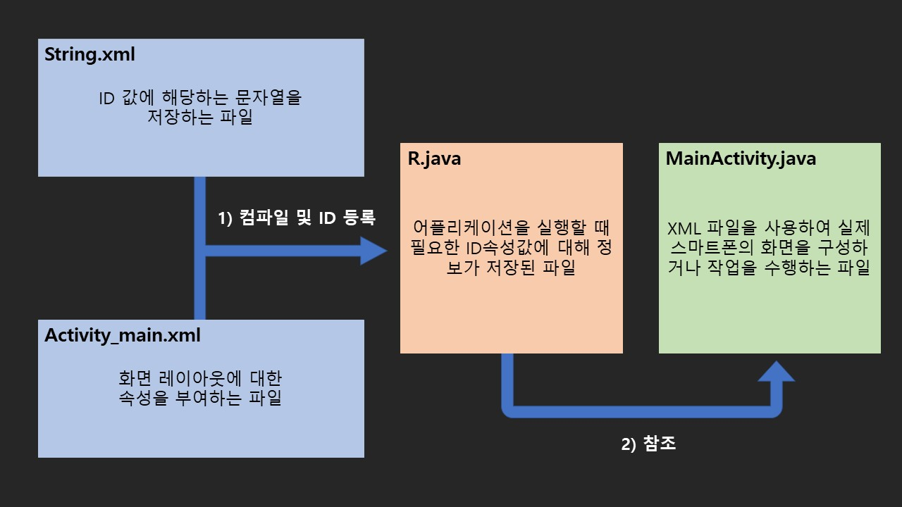
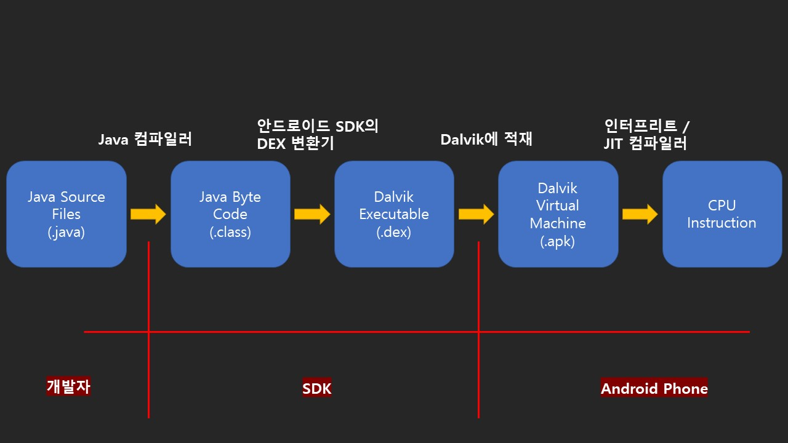
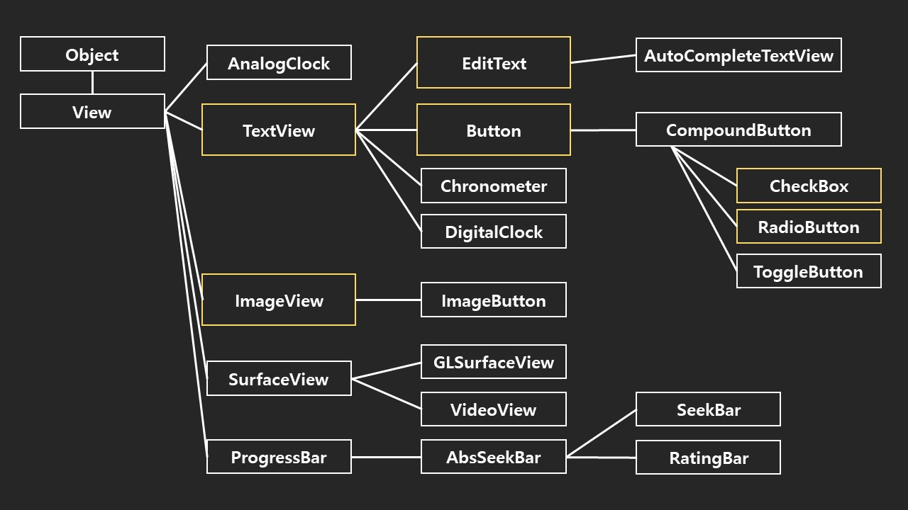

## 목차

- [안드로이드 프로젝트 구성 (1)](#안드로이드-프로젝트-구성-1)
  - [안드로이드 프로젝트 구조](#안드로이드-프로젝트-구조)
- [안드로이드 프로젝트 구성 (2)](#안드로이드-프로젝트-구성-2)
- [안드로이드 프로젝트 구성 (3)](#안드로이드-프로젝트-구성-3)
- [안드로이드 앱의 실행 과정](#안드로이드-앱의-실행-과정)
  - [컴파일 과정](#컴파일-과정)
  - [안드로이드 앱 배포과정](#안드로이드-앱-배포과정)
- [XML 레이아웃의 장점](#xml-레이아웃의-장점)
- [View](#view)
  - [1) 액티비티와 View](#1-액티비티와-view)
  - [2) View의 종류](#2-view의-종류)
    - [ViewGroup](#viewgroup)
    - [위젯](#위젯)
  - [3) View의 속성](#3-view의-속성)
    - [a) id 속성](#a-id-속성)
    - [b) clickable, longClickable 속성](#b-clickable-longclickable-속성)
    - [c) background 속성](#c-background-속성)
    - [d) padding 속성](#d-padding-속성)
    - [e) visibility 속성](#e-visibility-속성)
    - [f) focusable 속성](#f-focusable-속성)
- [TextView](#textview)
  - [1) TextView의 속성](#1-textview의-속성)
  - [2) text 속성](#2-text-속성)
  - [3) textColor 속성](#3-textcolor-속성)
  - [4) textSize 속성](#4-textsize-속성)
  - [5) textStyke 속성](#5-textstyke-속성)
  - [6) typeFace 속성](#6-typeface-속성)
  - [7) width, height 속성](#7-width-height-속성)
  - [8) singleLine 속성](#8-singleline-속성)
- [ImageView](#imageview)
  - [1) Src 속성](#1-src-속성)
  - [2) 이미지 포맷](#2-이미지-포맷)
  - [3) res/drawable](#3-resdrawable)
  - [4) maxHeight, maxWidth 속성과 minHeight, minWidth 속성](#4-maxheight-maxwidth-속성과-minheight-minwidth-속성)
  - [5) adjustViewBounds 속성](#5-adjustviewbounds-속성)
  - [6) cropToPadding 속성](#6-croptopadding-속성)
  - [7) tint 속성](#7-tint-속성)
  - [8) scaleType 속성](#8-scaletype-속성)
  - [9) ImageView 프로젝트](#9-imageview-프로젝트)
- [Button](#button)
- [EditText](#edittext)
- [ViewGroup](#viewgroup-1)
  - [1) layout_width, layout_height 속성](#1-layout_width-layout_height-속성)
  - [3) Padding 속성](#3-padding-속성)
  - [4) layout_margin](#4-layout_margin)
  - [5) padding과 layout_margin](#5-padding과-layout_margin)
- [용어 정리](#용어-정리)

# 안드로이드 프로젝트 구성 (1)

|파일명|개요|
|:---|:---|
|`java/MainActivity.java`|**JAVA 프로그램 파일**이 저장되는 폴더이며, 실제 **어플리케이션 실행**을 위한 코드|
|`build/R.java`|**프로그램 실행**을 위한 **ID 참조**를 위한 모든 속성이 저장된 파일|
|`res/drawable/*`|화면에 표시될 이미지가 저장되는 폴더|
|`res/layout/activity_main.xml`|레이아웃을 정의한 XML 파일|
|`res/value/strings.xml`|문자열의 속성을 정의한 XML 파일|
|`manifests/AndroidManifest.xml`|프로젝트의 버전이나 이름, 구성, 어플리케이션의 주요 속성을 정의한 XML 파일|

## 안드로이드 프로젝트 구조

# 안드로이드 프로젝트 구성 (2)

1. **`activity_main.xml`**

- 화면의 레이아웃은 JAVA 프로그램에서 직접 기술하지 않고 XML에서 기술된 레이아웃 리소스를 사용함
- RelativeLayout이라는 레이아웃 안에 TextView라는 문자열을 표시하는 View를 배치하고 있음
- TextView의 android:text 속성에는 @strings/hello_world 값이 지정되어 있음
- @strings/hello_world 값은 strings.xml에서 정의된 hell_world라는 이름의 문자열 ID로 대체된다는 것을 의미함

2. **`strings.xml`**

- 화면에 표시되는 문자열은 XML 문서안에서 정의되기도 하지만 strings.xml 파일에서 정의될 수 있음
- 레이아웃 리소스로 정의된 TextView에서 참조되고 있는 문자열(hello_world)
- 홈 스크린의 아이콘 아래에 표시하기 위한 문자열(app_name)을 정의함
- menu_main.xml 에서 사용되는 문자열(action_settings)을 정의함
- 사용되는 문자열을 JAVA 프로그램으로부터 분리하여, 영어나 다른 언어로 쉽게 변환될 수 있음

3. **`R.java`**

- 리소스 ID를 참조하기 위한 클래스
- R 클래스나 내부의 정수 정의는 개발툴(aapt:Android Asset Packagint Tool)에 의해 자동적으로 작성됨(리소스 파일들을 컴파일 한 후에 자동으로 리소스 ID를 등록함)
- JAVA 프로그램이나 XML 파일에서 참조하는 리소스의 ID는 R.java 파일에서 정의됨
- 개발자는 이 파일을 변경해서는 안됨
- R.java 클래스의 필드인 R.layout.activity_main은 JAVA 파일(MainActivity.java)의 setContentView가 인수로서 사용됨

# 안드로이드 프로젝트 구성 (3)

1. **`MainActivity.java`**

- 안드로이드 앱의 화면을 구성하거나 사용자와 상호작용하는 Activity(액티비티) 클래스를 상속받아 새로운 액티비티를 생성함
- 사용자의 요구에 반응하여 새로운 액티비티(화면)를 생성하거나 사용자의 요구사항을 만족시키는 작업을 수행함

2. **`AndroidManifest.xml`**

- 응용 프로그램 구성 정보를 담고 있음
- 매니페스트 파일의 이름은 프로젝트에 상관없이 AndroidManifest.xml로 고정되어 있음
- 안드로이드 앱 컴포넌트의 선언
- 안드로이드 앱의 실행을 위한 소유 권한 정의
- 안드로이드 앱이 필요로 하는 최소한의 API 레벨 정의
- 안드로이드 앱이 필요로 하는 H/W, S/W 기능 정의
- 안드로이드 앱이 필요로 하는 API 라이브러리 정의

# 안드로이드 앱의 실행 과정

## 컴파일 과정

- 안드로이드 앱은 JAVA 언어를 이용하여 작성함
- 개발자가 작성한 JAVA 코드는 JAVA 컴파일러에 의해 JAVA 바이트 코드로 컴파일 됨
- 원래 JAVA 환경에서는 컴파일 된 JAVA 바이트 코드를 JAVA 가상 머신을 통해 실행하지만 안드로이드는 Dalvik이라고 하는 별도의 가상 머신에서 실행함
- 안드로이드 SDK가 제공하는 DEX 변환기를 이용하여 JAVA 바이트 코드를 Dalvik의 실행 포맷인 .dex 파일로 변환해줌
- 변환된 .dex 파일은 안드로이드 스마트폰에 설치가 가능하며 설치 후 실행하면 Dalvik 가상 머신이 인터프리터 혹은 JIT 컴파일러를 이용하여 DEX 바이너리를 CPU가 인식할 수 있는 기계어 코드로 변환함
- DEX 변환기를 이용하여 JAVA 바이트 코드를 .dex 실행 파일로 변환하는 과정은 개발자가 코드를 개발하는 컴퓨터에서 수행됨

## 안드로이드 앱 배포과정

- 안드로이드 프로젝트에 대한 코드 컴파일 작업이 수행되면, JAVA 프로그램의 .class 파일이 생성되고, .class 파일을 이용하여 안드로이드 실행환경(Android runtime)에 적합한 .dex 파일이 생성됨
- 컴파일된 리소스 파일(XML)이 resources.arsc라는 파일로 생성됨
- 안드로이드 앱의 설정 환경을 저장하는 컴파일된 AndroidManifest.xml 파일이 생성됨
- 컴파일 되지 않은 리소스 파일(image 파일, 아이콘 파일 등)이 .dex 파일, resource.arsc 파일, AndroidManifest.xml 파일과 함께 패키징되어 .apk 파일이 생성됨
- debug key를 이용하여 .apk 파일에 서명을 하는 signing 작업을 하여 .apk파일이 타인에 의해서 위변조 되는 것을 방지함
- Goolge Play에 개발된 안드로이드 앱의 배포가 준비되면, 자신의 key 값을 이용하여 sigining 서명을 할 수 있음
- Singing 작업에서 사용한 키값은 안드로이드 앱의 업데이트에서 개발자의 식별에 사용됨

# XML 레이아웃의 장점

- 구조와 속성을 함축적으로 기술할 수 있으며 레이아웃 재활용도 가능함
- XML 파일은 어플리케이션 실행전에 미리 컴파일되므로 성능상의 영향은 없음
- XML 파일 컴파일 결과는 이진 포맷으로 바뀌어 실행 파일에 포함되므로 용량상의 낭비도 없음

# View

## 1) 액티비티와 View

- 액티비티는 안드로이드 앱의 화면을 구성하는 단위임
- 액티비티 자체는 화면에 직접적으로 보이지 않으며 액티비티 안의 View가 사용자에게 보여지는 실체를 구현함
- 여러 개의 View가 모여서 액티비티 하나를 구성하고 액티비티 여러 개가 모여서 하나의 안드로이드 앱을 구성함
- View의 파생 클래스 개수는 방대할 뿐만 아니라 각 클래스가 지원하는 속성이나 기능이 많음

## 2) View의 종류

### ViewGroup

- 직접적으로 보이지 않으며 다른 View를 담는 그릇 역할을 함
- 여러 개의 View를 유기적으로 모아 놓은 것
- ViewGroup 클래스들은 일반적으로 레이아웃이라고 함

### 위젯

- 직접적으로 보이며 사용자 인터페이스를 구성함
- Buttton, TextView, EditView, RadioButton 등이 대표적인 위젯이며 스스로 그릴 수 있는 능력을 가지고 있음

1. **위젯**

- 사용자들과 직접적인 상호작용을 이끌어내며, 상호작용의 결과를 표현하기 위해서도 사용됨
- 사용자로부터 입력된 값을 JAVA 프로그램에 전달하기도 함

2. **ViewGroup**

- 다른 View를 포함하며, 이렇게 포함된 View를 배치하는 기능을 가짐
- 편의상 위젯과 ViewGroup으로 나누지만 어떤 클래스는 ViewGroup이면서도 위젯처럼 사용되기도 함
- 항목의 집합을 표시하는 ListView는 다른 View를 포함하는 ViewGroup이면서 사용자에 직접적으로 보여짐
- 단순 위젯에 비해 여러 개의 View가 모여서 구현되며 많은 기능으로 인해 복잡함

## 3) View의 속성

### a) id 속성

- View의 이름을 정의함
- JAVA 프로그램이나 XML 문서에서 View를 참조할 때 ID를 사용하므로 의미를 잘 성명할 수 있는 직관적인 이름을 붙이는 경우가 많음
- 직관적인 ID의 사용은 JAVA  프로그램의 이해도나 가독성을 높여줄 수 있음
- `@[+]id/ID`
  - `@` : id를 R.java에 정의하거나 R.java로부터 참조한다는 뜻
  - `+` : ID를 새로 정의한다는 뜻인데 처음 정의할 때만 붙이고 참조할 때는 붙이지 않음
  - `id/` : 예약어
  - `ID` : 고유한 명칭(프로그래머가 결정)이므로 명칭 규칙에 맞아야 하며 View끼리 중복되어서는 안됨
  - ex) Button에 name이라는 id를 부여
    - `android:id="@+id/name"`
  - ex) Button에서 textView라는 id의 View를 접근함
    - `android:layout_below="@id/textView"`  

### b) clickable, longClickable 속성

- clickable : 마우스 클릭 이벤트 허용 여부를 결정함
- longClickable : 롱클릭 이벤트 허용 여부를 결정함
- click : 손가락으로 View를 누르는 것
- Long click : View를 누른 채로 잠시 기다린는 것
- 논리형이므로 true 또는 false 둘 중 하나의 값을 지정함

### c) background 속성

- View의 배경을 채우는 방법을 지정함
- 별다른 지정이 없다면 View의 기본 배경이 그려짐
- 여러 가지 객체로 배경을 지정할 수 있는데 가장 흔한 형태는 색상임
- 배경뿐만이 아니라 색상을 지정하는 방법도 background 속성을 이용하며 아래의 네가지 방법이 적용됨
  - #RGB
  - #ARGB
  - #RRGGBB
  - #AARRGGBB
- '#' 다음에 16진수로 각 색상 요소의 강도를 지정
- 웹에서 흔히 사용되는 표준화된 방식임

### d) padding 속성

- View와 내용물간의 간격을 지정함
- View의 안쪽 여백이며, TextView의 경우 TextView 자체와 중앙의 텍스트 사이에 padding 속성값 만큼 여백이 삽입됨
- padding 속성에 값을 지정하면 네 방향(상하좌우)에 대해 동일한 여백이 적용됨
- paddingLeft, paddingTop, paddingRight, paddingBottom 속성에 개별적으로 값을 지정해 각 변에 서로 다른 여백을 줄 수 있음

### e) visibility 속성

- 화면에 View의 표시 유무를 지정함
- 별다른 지정이 없으면 보이는 상태로 배치되지만 이 속성을 사용하면, 실행시에 필요할 때만 보이거나 숨길 수도 있음
- visibility 속성은 런타임에서도 얼마든지 변경 가능함
  |속성값|설명|
  |:---:|:---:|
  |visible|View가 보이는 상태|
  |invisible|View가 숨겨진 상태이지만 자리는 차지|
  |gone|View가 숨겨진 상태이며 자리도 차지하지 않음|
- invisible은 화면에 보이지는 않지만 자리는 여전히 차지하기 떄문에 gone과 다름
- invisible은 일시적인 투명 상태이며 gone은 완전히 사라진 상태임

### f) focusable 속성

- 키보드 포커스 허용 여부를 지정함
- View 클래스 자체는 디폴트로 포커스를 받지 않도록 되어 있으므로 키 입력을 받으려면 이 속성을 true로 변경해야함
- EditText나 Button처럼 사용자의 입력을 받아야 하는 파생 클래스는 focusable 속성의 디폴트가 true로 지정되어 있음

# TextView

## 1) TextView의 속성

- 화면에 텍스트를 출력하는 위젯
- 고정된 텍스트를 출력한다거나 다른 위젯의 제목을 표시할 때 사용됨
- TextView의 속성은 Button, EditText 등의 파생 클래스들에게도 공통적으로 적용됨
- TextView의 가장 중요한 속성으로 출력할 문자열을 지정하며, 기본으로 빈 문자열을 가지므로 속성값을 대입해야 함
- text="XXX"와 같은 형식으로 문자열을 지정함
- 다국어 버전 개발에 유용함
- 메시지 관리를 위해 문자열을 직접 지정하는 것보다 strings.xml에 문자열을 정의해 놓고 id를 지정하는 것이 유리함

## 2) text 속성

|형식|설명|
|---|---|
|"문자열"|겹 따옴표로 문자열을 싸서 바로 대입함. `\`문자가 들어가면 이스케이프됨. `\ n`은 개행이며 `\ uxxxxx`는 유니코드 문자임|
|@[패키지:]type:name|리소스에 대한 레퍼런스로 지정함. 보통 strings.xml에 문자열을 정의해 놓고 @string/id식으로 지정함 (**주로 쓰이는 방식**)|
|?[패키지:][type:]name|테마 속성으로 지정함.|

## 3) textColor 속성

- 문자열의 생상을 지정하며, #rrggbb나 #aarrggbb 형식으로 각 색상 요소들의 강도를 지정함
- 별다른 지정이 없을 때는 기본 색상이 적용되는데 불투명한 밝은 회색임

## 4) textSize 속성

- 텍스트의 폰트 크기를 지정하며, 실수 타입으로 정밀한 크기를 지정 할 수 있으며 숫자 뒤에 sp, dp, px, in, mm 등의 단위를 같이 지정해야 함
- 텍스트는 폰트 크기에 따라 가변적인 sp 단위를 쓰는 것이 가장 합리적임

## 5) textStyke 속성

- 폰트의 속성을 지정하며, normal, bold, italic, 중 하나를 쓰거나 아니면 '|'로 묶어 두 개 이상의 상수값을 지정할 수 있음
- 이때 '|'의 앞뒤로 공백이 있어서는 안되며 반드시 붙여서 써야 함.
  - ex) `"bold|italic"`

## 6) typeFace 속성

- 글꼴의 모양을 지정하며, 모바일 환경은 내장된 폰트 개수에 제약이 있으므로 다양한 글꼴을 지정할 수 없음
- normal, sans, serif, monospace 중 하나로 글꼴 모양을 선택할 수 있음

## 7) width, height 속성

- TextView의 폭과 높이이며 크기값과 단위를 같이 지정함
- 절대적인 크기를 지정하기보다는 레이아웃 안에서의 상대적인 크기가 더 중요함

## 8) singleLine 속성

- 출력될 문자열의 길이가 위젯의 폭보다 더 길때 강제로 한 줄에 출력하도록 함
- 위젯의 폭을 넘는 문자열은 오른쪽 끝이 잘리고, 대신 줄 끝에 `···` 생략 표시가 나타남
- singleLine 속성의 디폴트는 false로 폭보다 더 긴 줄은 자동으로 아래쪽에서 새로운 줄로 시작됨
- 여러 줄 출력이 기본 속성이지만 꼭 한 줄에 모두 출력하려면 이 속성을 true로 변경함

# ImageView

- 화면에 그림을 보여주는 위젯
- 그림이 ImageView의 내용물임

## 1) Src 속성

- 출력할 이미지를 지정하는 속성
- 이 속성에 값을 대입하지 않으면 아무것도 보이지 않으므로 반드시 지정해야 함
- #rrggbb 형태로 색상값을 정의할 수도 있고 외부의 이미지를 지정할 수도 있음
- 일반적으로 리소스 폴더에 이미지를 복사
- @drawable/ID 형식으로 이미지의 ID를 지정하면 해당 이미지가 ImageView의 표면에 출력됨

## 2) 이미지 포맷

- 공식적으로 jpg, png, gif 등의 이미지 포맷이 지원됨
- png 포맷은 알파 채널이 있어 반투명을 지원하며 직사각형이 아닌 이미지도 만들 수 있어 실용성이 높음

## 3) res/drawable

- ldpi : 120 정도의 낮은 해상도
- mdpi : 160 정도의 중해상도
- hdpi : 240 정도의 고해상도
- 이미지를 추가할 때는 res 폴더 밑의 drawable-mdpi 폴더에 이미지 파일을 복사하면 됨

## 4) maxHeight, maxWidth 속성과 minHeight, minWidth 속성

- 화면에 표현되는 이미지가 출력될 최대/최소 크기를 지정함

## 5) adjustViewBounds 속성

- 화면에 표현되는 이미지의 종횡비를 맞추기 위해 ImageView의 크기를 적당히 조정할 것인가를 지정함
- 참/거짓 둘 중 하나의 값만 지정 가능하므로 속성값은 true나 false 중 하나를 사용해야 함

## 6) cropToPadding 속성

- true 값일 경우 위젯의 주어진 여백에 맞추기 위해 이미지의 일부를 잘라냄

## 7) tint 속성

- 이미지에 색조를 입히며 #aarrggbb 형식으로 지정함
- 이미지에 대해서 색조를 지정하면 이미지 위에 덮여 출력됨
- 불투명한 색은 이미지를 완전히 가리므로 src 속성에 단색을 주는 것과 같은 효과를 나타냄

## 8) scaleType 속성

- 이미지 확대/축소 알고리즘을 지정하여 원래 크기와 다른 이미지를 화면에 표현함
- matrix, fitXY, centerm ceterCrop 등의 여러 가지 알고리즘 중 하나를 지정함

## 9) ImageView 프로젝트

- 이미지로 사용할 파일을 res 폴더에 복사만 해 놓으면 aapt가 컴파일 전에 res 폴더에서 새로 추가된 이미지 파일을 찾아내고 R.java에 파일명 ID를 자동 정의해 줌
- R.java 내용과 같이 sample이나 apple파일 이름으로 리소스 ID가 대입되므로 레이아웃 파일에서는 sample, apple 상수를 사용하기만 하면 됨
- 중간에 공백이 들어가면 안되며 특수 기호도 사용할 수 없고 영문 소문자와 언더바(_) 정도만 사용할 수 있는 파일 명칭 규칙에 맞게 조정해야 함
- 첫 번째 이미지는 단순히 src 속성만 정의했으므로 이미지의 원래 크기대로 출력됨
- 두 번째 이미지는 똑같은 src 속성을 지정하되 최대 크기를 100*80으로 제한했으므로 이 크기에 맞게 축소됨
- 마지막 이미지는 옅은 분홍색의 색조를 입혔으며 원본 이미지에 비해 분홍색을 얹힌 효과가 남

# Button

- 사용자가 선택해 명령을 내릴 수 있는 위젯이며 사각 모양을 하고 있으며 표면에 명령의 의미를 설명하는 문자열이 표시되어 있음

# EditText

- 문자열을 입력받는 위젯이며 간단히 줄여 에디트라고 부름
- TextView의 서브 클래스이므로 TextView의 모든 속성을 사용할 수 있으며 추가로 문자열 편집과 관련된 메소드를 제공함

# ViewGroup

## 1) layout_width, layout_height 속성

- View의 폭과 높이의 크기를 지정하는 속성
- View는 부모 View(또는 액티비티) 안에 배치될 때, layout_width, layout_height 속성이 지정하는 만큼의 크기로 부모 View 안에 배치됨
- 수평 방향과 수직 방향에 대해 크기를 지정할 수 있으며 다음 세 가지 중 하나의 값을 가짐

  |속성값|설명|
  |:---:|:---:|
  |`match_parent`|부모의 주어진 크기를 다 채운다.|
  |`wrap_content`|내용물의 크기만큼만 채운다.|
  |`정수 크기`|지정한 크기에 맞춘다.|

## 3) Padding 속성

- View와 내용물간의 간격을 지정함
- Button의 경우 Button 내부의 문자열과 Button 테두리와의 간격이 padding이며 레이아웃의 경우 자식 View와의 간격이 padding임
- padding 속석에 값을 대입하면 4면 모두 동일한 여백이 적용되어 한번에 여백을 지정할 수 있음
- paddingLeft, paddingTop, paddingRight, paddingBottom 속성에 각각의 여백을 지정함

## 4) layout_margin

- View와 부모와의 간격을 지정하면 근처에 형제 View가 있으면 형제 View와의 간격도 layout_margin 만큼 떨어짐
- padding과 마찬가지로 layout_margin 속성 자체는 4면의 여백을 동일하게 지정함
- 각 면에 개별적인 여백을 지정하고 싶으면 layout_marginLeft, layout_marginRight, layout_marginTop, layout_marginBottom 속성을 각각 대입할 수 있음
- layout_margin 속성에 값을 대입하면 4방향으로 모두 같은 layout_margin이 적용됨
- 원하는 방향에 대해서만 layout_margin을 지정할 수도 있음

## 5) padding과 layout_margin

- padding 과 layout_margin은 둘 다 여백이라는 면에서는 유사하지만 적용되는 위치는 완전히 반대임
- layout_margin은 View와 부모 사이에 적용되며, padding은 View와 내용물 사이에 적용됨
- View의 입장에서 볼 때 layout_margin 속성은 바깥 여백이고 padding 속성은 안쪽 여백임
- padding은 View의 내부이므로 크기에 포함되지만 layout_margin은 그렇지 않다는 점에서 다름
- padding은 View 자체 속성이지만 layout_margin은 레이아웃 속성임

# 용어 정리

- **XML**
  - XML은 마크업 언어의 일종으로, 문서를 사람과 기계 모두가 읽을 수 있는 형식으로 부호화하는 규칙의 집합을 정의함
- **레이아웃**
  - 배치 그 자체를 나타냄. 출력(output)의 양식이나 양식의 설계 등을 모두 레이아웃이라는 말로 사용함
- **안드로이드 액티비티**
  - 안드로이드 어플리케이션의 화면을 구성하는 컴포넌트이며 여러 개의 View로 구성됨
- **View**
  - 안드로이드의 사용자 인터페이스를 구성하는 핵심으로서 화면상의 사각영역에 자신의 모양을 그리고 사용자의 입력을 받아들이는 객체
- **런타임(runtime)**
  - 컴퓨터 프로그램이 실행되고 있는 동안의 동작을 말함
- **안드로이드 앱 컴포넌트(어플리케이션 컴포넌트)**
  - 액티비티 (activity), 서비스 (service), 브로드캐스트 리시버 (broadcast receiver), 콘텐트 프로바이더 (content provider)
- **aapt(Android Asset Packagint Tool)**
  - /res 폴더에 새로운 리소스(이미지, 동영상 등)이 추가되면 자동으로 리소스를 컴파일하고, 이에 대한 정보를 R.java 파일에 반영함
- **Dalvik**
  - JIT(Just In Time) 방식의 컴파일 환경을 기반으로 안드로이드 스마트폰의 가상머신
- **ART(Aondroid RunTime)** 
  - 앱을 설치하기 전에 컴파일을 끝내고 앱을 실행하는 안드로이드 스마트폰의 가상머신(LOLIPOP 이후의 가상머신)
- **ADB(Android Debug Bridge)**
  - 컴퓨터에서 스마트폰을 제어할 수 있는 셀스크립트 기반의 안드로이드 개발 도구
- **TextView**
  - 화면에 텍스트를 출력하는 위젯
- **ImageView**
  - 화면에 아이콘이나 비트맵을 출력하는 위젯
- **위젯**
  - 컴퓨터에서 운영 체계 위의 응용 프로그램을 동작시키고 결과를 화면에 표시하는 작은 그래픽 사용자 인터페이스(GUI)도구
- **이벤트**
  - 프로그램이 반응하도록 사용자가 생성시키는 동작 또는 사건의 발생
- **리스너**
  - 데이터를 받는 쪽을 말함