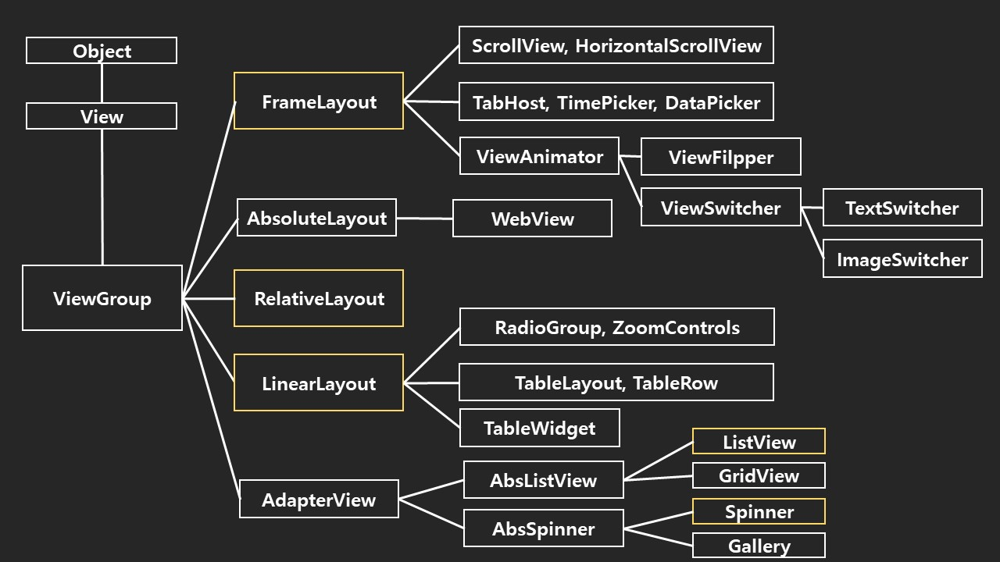

## 목차

- [안드로이드 프로젝트 구성 (1)](#안드로이드-프로젝트-구성-1)
  - [안드로이드 프로젝트 구조](#안드로이드-프로젝트-구조)
- [안드로이드 프로젝트 구성 (2)](#안드로이드-프로젝트-구성-2)
- [안드로이드 프로젝트 구성 (3)](#안드로이드-프로젝트-구성-3)
- [XML 레이아웃의 장점](#xml-레이아웃의-장점)
- [View](#view)
  - [1) 액티비티와 View](#1-액티비티와-view)
  - [2) View의 종류](#2-view의-종류)
    - [ViewGroup](#viewgroup)
    - [위젯](#위젯)
- [용어 정리](#용어-정리)

# 안드로이드 프로젝트 구성 (1)

|파일명|개요|
|:---|:---|
|`java/MainActivity.java`|**JAVA 프로그램 파일**이 저장되는 폴더이며, 실제 **어플리케이션 실행**을 위한 코드|
|`build/R.java`|**프로그램 실행**을 위한 **ID 참조**를 위한 모든 속성이 저장된 파일|
|`res/drawable/*`|화면에 표시될 이미지가 저장되는 폴더|
|`res/layout/activity_main.xml`|레이아웃을 정의한 XML 파일|
|`res/value/strings.xml`|문자열의 속성을 정의한 XML 파일|
|`manifests/AndroidManifest.xml`|프로젝트의 버전이나 이름, 구성, 어플리케이션의 주요 속성을 정의한 XML 파일|

## 안드로이드 프로젝트 구조

# 안드로이드 프로젝트 구성 (2)

1. **`activity_main.xml`**

- 화면의 레이아웃은 JAVA 프로그램에서 직접 기술하지 않고 XML에서 기술된 레이아웃 리소스를 사용함
- RelativeLayout이라는 레이아웃 안에 TextView라는 문자열을 표시하는 View를 배치하고 있음
- TextView의 android:text 속성에는 @strings/hello_world 값이 지정되어 있음
- @strings/hello_world 값은 strings.xml에서 정의된 hell_world라는 이름의 문자열 ID로 대체된다는 것을 의미함

2. **`strings.xml`**

- 화면에 표시되는 문자열은 XML 문서안에서 정의되기도 하지만 strings.xml 파일에서 정의될 수 있음
- 레이아웃 리소스로 정의된 TextView에서 참조되고 있는 문자열(hello_world)
- 홈 스크린의 아이콘 아래에 표시하기 위한 문자열(app_name)을 정의함
- menu_main.xml 에서 사용되는 문자열(action_settings)을 정의함
- 사용되는 문자열을 JAVA 프로그램으로부터 분리하여, 영어나 다른 언어로 쉽게 변환될 수 있음

3. **`R.java`**

- 리소스 ID를 참조하기 위한 클래스
- R 클래스나 내부의 정수 정의는 개발툴(aapt:Android Asset Packagint Tool)에 의해 자동적으로 작성됨(리소스 파일들을 컴파일 한 후에 자동으로 리소스 ID를 등록함)
- JAVA 프로그램이나 XML 파일에서 참조하는 리소스의 ID는 R.java 파일에서 정의됨
- 개발자는 이 파일을 변경해서는 안됨
- R.java 클래스의 필드인 R.layout.activity_main은 JAVA 파일(MainActivity.java)의 setContentView가 인수로서 사용됨

# 안드로이드 프로젝트 구성 (3)

1. **`MainActivity.java`**

- 안드로이드 앱의 화면을 구성하거나 사용자와 상호작용하는 Activity(액티비티) 클래스를 상속받아 새로운 액티비티를 생성함
- 사용자의 요구에 반응하여 새로운 액티비티(화면)를 생성하거나 사용자의 요구사항을 만족시키는 작업을 수행함

2. **`AndroidManifest.xml`**

- 응용 프로그램 구성 정보를 담고 있음
- 매니페스트 파일의 이름은 프로젝트에 상관없이 AndroidManifest.xml로 고정되어 있음
- 안드로이드 앱 컴포넌트의 선언
- 안드로이드 앱의 실행을 위한 소유 권한 정의
- 안드로이드 앱이 필요로 하는 최소한의 API 레벨 정의
- 안드로이드 앱이 필요로 하는 H/W, S/W 기능 정의
- 안드로이드 앱이 필요로 하는 API 라이브러리 정의

# XML 레이아웃의 장점

- 구조와 속성을 함축적으로 기술할 수 있으며 레이아웃 재활용도 가능함
- XML 파일은 어플리케이션 실행전에 미리 컴파일되므로 성능상의 영향은 없음
- XML 파일 컴파일 결과는 이진 포맷으로 바뀌어 실행 파일에 포함되므로 용량상의 낭비도 없음

# View

## 1) 액티비티와 View

- 액티비티는 안드로이드 앱의 화면을 구성하는 단위임
- 액티비티 자체는 화면에 직접적으로 보이지 않으며 액티비티 안의 View가 사용자에게 보여지는 실체를 구현함
- 여러 개의 View가 모여서 액티비티 하나를 구성하고 액티비티 여러 개가 모여서 하나의 안드로이드 앱을 구성함
- View의 파생 클래스 개수는 방대할 뿐만 아니라 각 클래스가 지원하는 속성이나 기능이 많음

## 2) View의 종류

### ViewGroup

- 직접적으로 보이지 않으며 다른 View를 담는 그릇 역할을 함
- 여러 개의 View를 유기적으로 모아 놓은 것
- ViewGroup 클래스들은 일반적으로 레이아웃이라고 함

### 위젯

- 직접적으로 보이며 사용자 인터페이스를 구성함
- Buttton, TextView, EditView, RadioButton 등이 대표적인 위젯이며 스스로 그릴 수 있는 능력을 가지고 있음

1. **위젯**

- 사용자들과 직접적인 상호작용을 이끌어내며, 상호작용의 결과를 표현하기 위해서도 사용됨
- 사용자로부터 입력된 값을 JAVA 프로그램에 전달하기도 함

1. **ViewGroup**

- 다른 View를 포함하며, 이렇게 포함된 View를 배치하는 기능을 가짐
- 편의상 위젯과 ViewGroup으로 나누지만 어떤 클래스는 ViewGroup이면서도 위젯처럼 사용되기도 함
- 항목의 집합을 표시하는 ListView는 다른 View를 포함하는 ViewGroup이면서 사용자에 직접적으로 보여짐
- 단순 위젯에 비해 여러 개의 View가 모여서 구현되며 많은 기능으로 인해 복잡함

# 용어 정리

- **XML**
  - XML은 마크업 언어의 일종으로, 문서를 사람과 기계 모두가 읽을 수 있는 형식으로 부호화하는 규칙의 집합을 정의함
- **레이아웃**
  - 배치 그 자체를 나타냄. 출력(output)의 양식이나 양식의 설계 등을 모두 레이아웃이라는 말로 사용함
- **안드로이드 액티비티**
  - 안드로이드 어플리케이션의 화면을 구성하는 컴포넌트이며 여러 개의 View로 구성됨
- **View**
  - 안드로이드의 사용자 인터페이스를 구성하는 핵심으로서 화면상의 사각영역에 자신의 모양을 그리고 사용자의 입력을 받아들이는 객체
- **런타임(runtime)**
  - 컴퓨터 프로그램이 실행되고 있는 동안의 동작을 말함
- **안드로이드 앱 컴포넌트(어플리케이션 컴포넌트)**
  - 액티비티 (activity), 서비스 (service), 브로드캐스트 리시버 (broadcast receiver), 콘텐트 프로바이더 (content provider)
- **aapt(Android Asset Packagint Tool)**
  - /res 폴더에 새로운 리소스(이미지, 동영상 등)이 추가되면 자동으로 리소스를 컴파일하고, 이에 대한 정보를 R.java 파일에 반영함