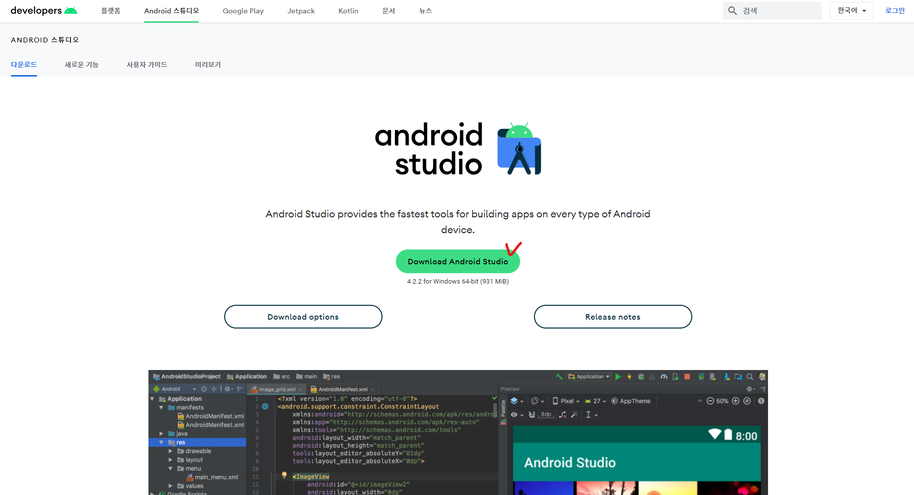
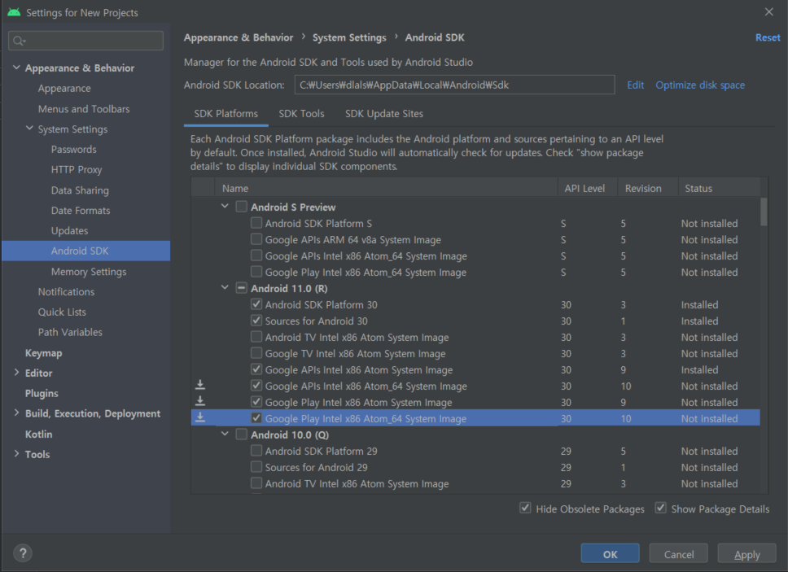
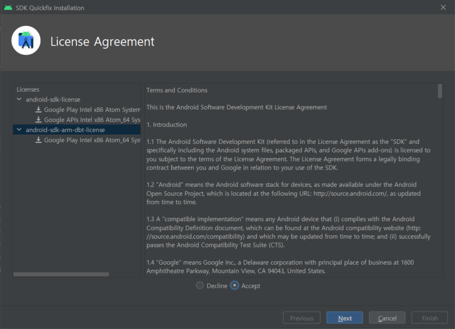
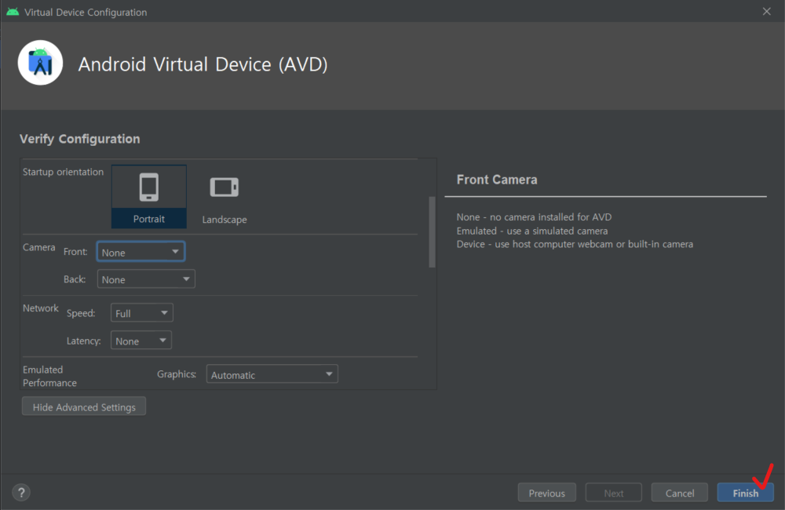

# 안드로이드 스튜디오 Start

- [안드로이드 스튜디오 Start](#안드로이드-스튜디오-start)
  - [1. 안드로이드 스튜디오 다운로드](#1-안드로이드-스튜디오-다운로드)
  - [2. 안드로이드 스튜디오 설치](#2-안드로이드-스튜디오-설치)
  - [3. 안드로이드 스튜디오 설정](#3-안드로이드-스튜디오-설정)
  - [4. 프로젝트 생성](#4-프로젝트-생성)
  - [5. Android SDK 설정 및 설치](#5-android-sdk-설정-및-설치)
  - [6. 안드로이드 가상 디바이스 AVD(Android Virtual Device) 설치](#6-안드로이드-가상-디바이스-avdandroid-virtual-device-설치)

## 1. 안드로이드 스튜디오 다운로드

- [안드로이드 다운로드 https://developer.android.com/studio/?hl=ko](https://developer.android.com/studio/?hl=ko)

- 운영체제에 맞게 다운받기

## 2. 안드로이드 스튜디오 설치

1. 다운받은 `.exe` 실행파일 실행

2. `Next >` 클릭

3. 설치옵션 화면에서 `가상 드라이브(AVD)`를 체크 후 `Next >` 클릭

4. 안드로이드 `SDK` 경로 확인후 `Next >` 클릭 (원하는 경로로 변경 가능)

5. `Install` 클릭 후 설치 시작

6. 설치 로딩이 완료되면 `Next >` 클릭

7. 마지막 `Finish` 클릭 후 안드로이드 스튜디오 실행

8. `Do not import settings` 체크 후 `OK` 클릭

## 3. 안드로이드 스튜디오 설정

1. `Next` 클릭

2. `Standard` 체크 후 `Next` 클릭

3. 원하는 UI 테마 설정 후 `Next` 클릭 (나중에 Setting 메뉴에서 변경 가능)

4. `Finish` 클릭

5. 컴포넌트 다운로드가 끝나면 `Finish` 클릭

## 4. 프로젝트 생성

- [[3. 안드로이드 스튜디오 설정]](#3-안드로이드-스튜디오-설정)이 끝나면 아래와 같이 순차적으로 진행

1. `Create New Project` 클릭

2. `Phone and Tablet` 메뉴에 `Empty Activity`를 선택 후 `Next` 클릭

3. 프로젝트 환경설정 후 `Finish` 클릭
- `Name` : App 이름을 입력한다.
- `Package name` : 기본 패키지 이름을 입력한다.
- `Save Location` : 저장될 프로젝트 경로를 설정해준다.
- `Language` : 사용할 프로그래밍 언어 Java 또는 Kotlin을 선택한다.
- `Minimum SDK` : 앱이 지원할 가장 낮은 Android 버전을 선택한다.

4. 안드로이드 스튜디오 IDE가 열리며 Gradle 빌드가 정상적으로 끝나면 아래와 같이 프로젝트가 보인다.

## 5. Android SDK 설정 및 설치

- Android SDK 설정 확인하기
- 상단의 `Tools` -> `SDK Manager` 선택

1. `Android SDK` 메뉴에서 `SDK Platforms` 탭을 클릭 후 필요한 플랫폼 선택
   1. Android SDK 버전 선택 (나는 11.0 선택) 
2. 에뮬레이터를 사용할 수 있는 Google APIs와 Google Play 시스템 이미지
를 선택
   1. 세부항목 (`show Package Details`)
      1. Android SDK Platform
      2. Sources for Android
      3. Google APIs Intel x86 Atom System Image
      4. Google APIs Intel x86 Atom_64 System Image
      5. Google Play Intel x86 Atom System Image
      6. Google Play Intel x86 Atom_64 System Image

3. `Android SDK` 메뉴에서 `SDK Tools` 탭을 클릭 후 필요한 항목 선택
   1. Android SDK Build-Tools, Android SDK Platform-Tools, Android SDK Tools는 반드시 설치
   2. 에뮬레이터를 사용하기 위한 Android Emulator와 Intel x86 Emulator Accelerator
(HAXM installer)도 설치
- `SDK Tools` 에는 안드로이드 프로젝트 빌드를 위해 필요한 도구, 에뮬레이터, 기본적으로 필요한 라이브러리 등이 포함되어 있음

4. 필요한 SDK 설정이 끝나면 `OK` 클릭
5. License Agreement 화면에서 모든 라이센스 항목 `Accept` 체크 후 `Next` 클릭

6. 설치가 완료되면 `Finish` 클릭

## 6. 안드로이드 가상 디바이스 AVD(Android Virtual Device) 설치

- 상단의 `Tools` -> `AVD Manager` 클릭

1. 하단의 `Create Virtual Device...` 클릭

2. `Phone` -> `Nexus 4` -> `Next` 클릭

3. 이전의 [[5. Android SDK 설정]](#5-android-sdk-설정)에서 설치했던 SDK 버전과 동일한 이름으로 선택 후 `Next` 클릭

4. 세부설정을 위한 `Show Advanced Settings` 클릭

5. `Camera` 부분 수정 후 `Finish` 클릭
   1. `Front` -> `None`
   2. `Back` -> `None`

6. `Finish` 클릭

7. 가상 디바이스 리스트에서 추가한 디바이스의 오른쪽 끝에 `Action` 버튼을 클릭하면 빈 AVD가 실행된다.

